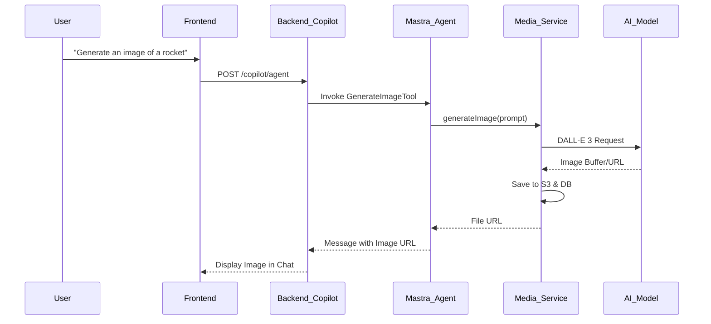

# Agents Module Technical Documentation

This document provides a comprehensive overview of the `Agents` module within the Postiz application. It covers the architecture, frontend-backend interactions, AI agent capabilities (tools), and core workflows.

---

## 1. Architecture Overview

The Agents module is built on a modern AI stack that facilitates seamless interaction between users, AI models, and social media platforms.

- **Frontend**: Next.js (App Router) with [CopilotKit](https://www.copilotkit.ai/) for the chat UI and runtime synchronization.
- **Backend**: NestJS-based API providing a custom endpoint for CopilotKit.
- **AI Orchestration**: [Mastra](https://mastra.ai/) framework for managing agents, tools, memory, and multi-modal generation (Text, Image, Video).
- **Storage**: S3-compatible storage (Cloudflare R2) for media assets generated by AI.

---

## 2. Frontend Components & Interaction

The frontend is located in `apps/frontend/src/components/agents/`.

### Key Components
- **`Agent` (`agent.tsx`)**: The layout wrapper providing context for selected social channels (`PropertiesContext`).
- **`AgentList` (`agent.tsx`)**: A sidebar for selecting social media channels to be used as context for the AI.
- **`AgentChat` (`agent.chat.tsx`)**: The core chat interface using `<CopilotKit />`. It passes the selected `integrations` to the backend as properties.
- **`Threads` (`agent.tsx`)**: Sidebar component that lists historical conversation threads.

### State Management
- **PropertiesContext**: Captures the IDs and metadata of selected social channels.
- **CopilotKit State**: Manages the message stream and synchronization with the backend runtime.

---

## 3. Backend API Reference

The backend exposes several endpoints specifically for the Agents module under the `/copilot` and `/media` prefixes.

### Core AI Endpoints (`/copilot`)
| Endpoint | Method | Description |
| :--- | :--- | :--- |
| `/copilot/agent` | `POST` | The main runtime endpoint for CopilotKit. Orchestrates Mastra agents and tools. |
| `/copilot/list` | `GET` | Retrieves a paginated list of chat threads for the organization. |
| `/copilot/:thread/list` | `GET` | Retrieves the message history for a specific thread. |
| `/copilot/credits` | `GET` | Checks remaining AI credits (images/videos) for the organization. |

### Media & Generation Endpoints (`/media`)
| Endpoint | Method | Description |
| :--- | :--- | :--- |
| `/media/generate-image` | `POST` | Generates an image based on a prompt (DALL-E 3). |
| `/media/generate-video` | `POST` | Generates a video based on specified options. |
| `/media/list` | `GET` | Lists all media assets available in the library. |
| `/media/upload-simple` | `POST` | Standard file upload for user-provided attachments. |

---

## 4. AI Agent Capabilities (Mastra Tools)

The `postiz` agent is equipped with several tools defined in `libraries/nestjs-libraries/src/chat/tools/`. These tools allow the AI to perform actions beyond simple chat.

- **`IntegrationListTool`**: Informs the AI about the user's connected social channels.
- **`IntegrationValidationTool`**: Validates post content against platform-specific rules (e.g., character limits, image counts).
- **`GenerateImageTool` / `GenerateVideoTool`**: Triggers multi-modal content creation.
- **`IntegrationSchedulePostTool`**: Prepares a post for scheduling. In UI mode, this triggers the `manualPosting` action on the frontend.

### Agent Instructions
The agent is instructed to:
1.  Always use `IntegrationValidationTool` before scheduling.
2.  Respect platform-specific formats (HTML, Markdown, or Plain Text).
3.  Ask for user confirmation before final scheduling.

---

## 5. Core Workflows

### 5.1 Content Generation & Scheduling (Human-in-the-Loop)
1.  **Selection**: User selects LinkedIn and Twitter in the sidebar.
2.  **Request**: User asks, "Create a post about our new feature for these channels."
3.  **Context**: Frontend sends `integrations` IDs to `/copilot/agent`.
4.  **Processing**: AI generates text/images and validates them via `IntegrationValidationTool`.
5.  **Action**: AI triggers `manualPosting`.
6.  **Review**: Frontend opens `AddEditModal` pre-populated with AI content.
7.  **Finalize**: User confirms/edits and clicks "Schedule," calling the standard `/launches` API.

### 5.2 AI Multi-modal Generation Flow

---

## 6. Integration Rules Summary
AI follows strict rules based on platform identifiers:
- **X (Twitter)**: Handle threads vs. long posts based on premium status.
- **LinkedIn/Facebook**: Handle multi-part content as post + comments.
- **Format**: Wrap lines in `
` for HTML platforms; use specific allowed tags (`h1`, `h2`, `strong`, etc.).
