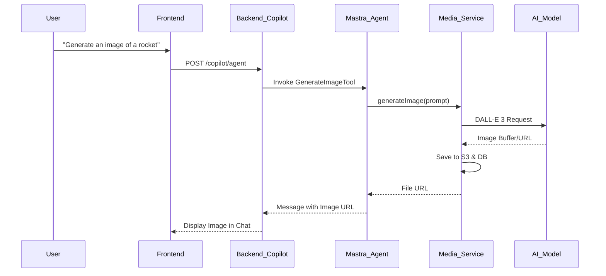

# Agents Module Technical Documentation

This document provides a comprehensive overview of the `Agents` module within the Postiz application. It covers the architecture, frontend-backend interactions, AI agent capabilities (tools), and core workflows.

---

## 1. Architecture Overview

The Agents module is built on a modern AI stack that facilitates seamless interaction between users, AI models, and social media platforms.

- **Frontend**: Next.js (App Router) with [CopilotKit](https://www.copilotkit.ai/) for the chat UI and runtime synchronization.
- **Backend**: NestJS-based API providing a custom endpoint for CopilotKit.
- **AI Orchestration**: [Mastra](https://mastra.ai/) framework for managing agents, tools, memory, and multi-modal generation (Text, Image, Video).
- **Storage**: S3-compatible storage (Cloudflare R2) for media assets generated by AI.

---

## 2. Frontend Components & Interaction

The frontend is located in `apps/frontend/src/components/agents/`.

### Key Components
- **`Agent` (`agent.tsx`)**: The layout wrapper providing context for selected social channels (`PropertiesContext`).
- **`AgentList` (`agent.tsx`)**: A sidebar for selecting social media channels to be used as context for the AI.
- **`AgentChat` (`agent.chat.tsx`)**: The core chat interface using `<CopilotKit />`. It passes the selected `integrations` to the backend as properties.
- **`Threads` (`agent.tsx`)**: Sidebar component that lists historical conversation threads.

### State Management
- **PropertiesContext**: Captures the IDs and metadata of selected social channels.
- **CopilotKit State**: Manages the message stream and synchronization with the backend runtime.

---

## 3. Backend API Reference

The backend exposes several endpoints specifically for the Agents module under the `/copilot` and `/media` prefixes.

### Core AI Endpoints (`/copilot`)
| Endpoint | Method | Description |
| :--- | :--- | :--- |
| `/copilot/agent` | `POST` | The main runtime endpoint for CopilotKit. Orchestrates Mastra agents and tools. Includes pre-chat credit check (402 if insufficient) and post-response token billing. |
| `/copilot/list` | `GET` | Retrieves a paginated list of chat threads for the organization. |
| `/copilot/:thread/list` | `GET` | Retrieves the message history for a specific thread. |
| `/copilot/credits` | `GET` | Checks remaining AI credits (images/videos) for the organization. |

### Media & Generation Endpoints (`/media`)
| Endpoint | Method | Description |
| :--- | :--- | :--- |
| `/media/generate-image` | `POST` | Generates an image based on a prompt (DALL-E 3). |
| `/media/generate-video` | `POST` | Generates a video based on specified options. |
| `/media/list` | `GET` | Lists all media assets available in the library. |
| `/media/upload-simple` | `POST` | Standard file upload for user-provided attachments. |

---

## 4. AI Agent Capabilities (Mastra Tools)

The `postiz` agent is equipped with several tools defined in `libraries/nestjs-libraries/src/chat/tools/`. These tools allow the AI to perform actions beyond simple chat.

- **`IntegrationListTool`**: Informs the AI about the user's connected social channels.
- **`IntegrationValidationTool`**: Validates post content against platform-specific rules (e.g., character limits, image counts).
- **`GenerateImageTool` / `GenerateVideoTool`**: Triggers multi-modal content creation.
- **`IntegrationSchedulePostTool`**: Prepares a post for scheduling. In UI mode, this triggers the `manualPosting` action on the frontend.

### Agent Instructions
The agent is instructed to:
1.  Always use `IntegrationValidationTool` before scheduling.
2.  Respect platform-specific formats (HTML, Markdown, or Plain Text).
3.  Ask for user confirmation before final scheduling.

---

## 5. Core Workflows

### 5.1 Content Generation & Scheduling (Human-in-the-Loop)
1.  **Selection**: User selects LinkedIn and Twitter in the sidebar.
2.  **Request**: User asks, "Create a post about our new feature for these channels."
3.  **Context**: Frontend sends `integrations` IDs to `/copilot/agent`.
4.  **Processing**: AI generates text/images and validates them via `IntegrationValidationTool`.
5.  **Action**: AI triggers `manualPosting`.
6.  **Review**: Frontend opens `AddEditModal` pre-populated with AI content.
7.  **Finalize**: User confirms/edits and clicks "Schedule," calling the standard `/launches` API.

### 5.2 AI Multi-modal Generation Flow


---

## 6. Agent Model Selection

The agent's LLM model is driven by the `ai_model_pricing` Settings config (see [ai-pricing-module.md](./ai-pricing-module.md)). The `text` entry determines which model the agent uses:

```json
{ "servicer": "openrouter", "provider": "openai", "model": "gpt-5.1" }
```

- `servicer=openrouter` → uses OpenRouter API with model ID `openai/gpt-5.1`
- `servicer=openai` → uses OpenAI API directly with model ID `gpt-5.1`
- If no config exists, falls back to environment variables (`OPENROUTER_TEXT_MODEL` / `OPENAI_API_KEY`)

The model is resolved once at Mastra Agent initialization (singleton). Config changes require a backend restart.

## 7. Agent Chat Billing

Each `/copilot/agent` request follows this billing flow:

1. **Pre-check**: `checkMinChatCredits()` estimates minimum cost (~500 tokens) and returns HTTP 402 if balance is insufficient.
2. **Usage collection**: The LLM model is wrapped with `withBillingTracking()` (Proxy on `doGenerate`/`doStream`) that captures token usage into `AsyncLocalStorage`.
   - **Important**: For `doStream`, the `TransformStream.transform` callback runs in a detached async context where ALS is lost. The middleware captures the ALS store reference (`ctxSnapshot`) before creating the TransformStream and writes directly to `ctxSnapshot.usages` to bypass the ALS lookup.
3. **Post-billing**: On `res.close`, collected usages are sent to Aisee via `billCollectedUsages()` (fire-and-forget). A local `BillingRecord` is created for audit.

### Admin Billing API

Failed billing records (e.g. Aisee service down) can be retried via admin endpoints:

| Endpoint | Method | Description |
|----------|--------|-------------|
| `/admin/billing/records` | GET | List billing records (filterable by status, org, businessType) |
| `/admin/billing/records/:id` | GET | Single record detail |
| `/admin/billing/summary` | GET | Aggregated counts by status and businessType |
| `/admin/billing/retry/:id` | POST | Retry single failed record |
| `/admin/billing/retry-all-failed` | POST | Batch retry all failed records |

All admin endpoints require `@SuperAdmin()` permission.

### Memory Configuration

Mastra Memory is configured with `lastMessages: false` and `semanticRecall: false` to prevent duplicate message injection — CopilotKit already sends the full conversation history in each request. Messages are still persisted for thread management and the `/copilot/:thread/list` endpoint.

## 8. Agent Tools Reference

The `postiz` agent has 8 tools, each triggered by LLM intent recognition:

| Tool | File | Trigger | Billing |
|------|------|---------|---------|
| `integrationList` | `integration.list.tool.ts` | Need channel list | No |
| `integrationSchema` | `integration.validation.tool.ts` | Before scheduling (required) | No |
| `triggerTool` | `integration.trigger.tool.ts` | Need platform-specific data (tag IDs, etc.) | No |
| `schedulePostTool` | `integration.schedule.post.ts` | User confirms post → calls `PostsService.createPost()` | No (post itself) |
| `generateImageTool` | `generate.image.tool.ts` | Need image for post → `MediaService.generateImage()` | `image_gen` |
| `generateVideoOptions` | `generate.video.options.tool.ts` | User wants video, list options | No |
| `videoFunctionTool` | `video.function.tool.ts` | Pre-video data (voice ID, etc.) | No |
| `generateVideoTool` | `generate.video.tool.ts` | Confirm video → `MediaService.generateVideo()` | TODO: `video_gen` |

### schedulePostTool Details

Supports three modes via `type` field:
- `now` — immediate publish (triggers Temporal workflow immediately)
- `schedule` — future publish (Temporal workflow sleeps until publishDate)
- `draft` — save without publishing

The tool validates integration existence (returns error if not found), checks platform-specific settings via DTO validation, and enforces character limits per platform. On validation error, the LLM automatically retries with corrected parameters.

A single `/copilot/agent` conversation may produce multiple billing records:
- **LLM tokens** (`ai_copywriting`) — always, from the agent conversation itself
- **Image generation** (`image_gen`) — if `generateImageTool` was called
- **Video generation** (`video_gen`) — if `generateVideoTool` was called (TODO)

## 9. Integration Rules Summary
AI follows strict rules based on platform identifiers:
- **X (Twitter)**: Handle threads vs. long posts based on premium status.
- **LinkedIn/Facebook**: Handle multi-part content as post + comments.
- **Format**: Wrap lines in `<p>` for HTML platforms; use specific allowed tags (`h1`, `h2`, `strong`, etc.).

## 10. Testing

### Test Runner

Tests use **Vitest** (config: `vitest.config.ts`). Run with:

```bash
npx vitest run
```

### Test Files

| File | Tests | Coverage |
|------|-------|---------|
| `chat/__tests__/billing.middleware.spec.ts` | 9 | ALS context fix, doGenerate/doStream token collection, provider detection |
| `chat/tools/__tests__/integration.schedule.post.spec.ts` | 16 | now/schedule/draft, multi-channel, X thread, batch 5-day, attachments, settings, edge cases |

### Manual Test Scenarios

See `tests/copilot-schedule-scenarios.md` for 17 manual test scenarios covering various conversation styles, multi-channel scheduling, and edge cases.
