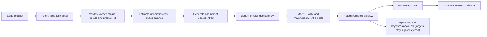

# Aisee Operation Plan Integration Contract

**Status:** Proposed  
**Owner:** Postiz  
**Upstream system:** `../aisee-core`  
**Full product and operations plan :** [aisee-core document](../../aisee-core/docs/aisee-live-geo-growth-plan.md)

## 1. Purpose

This document defines only the Postiz changes required to turn an Aisee analysis into a project-scoped publishing and engagement plan. Campaign strategy, report interpretation, editorial copy, and the rendered 30-day example belong to `aisee-core` and are intentionally not duplicated here.

The implementation must support any API-supplied campaign duration. The filename is retained for link compatibility; **30 days is an example, not a product constant**.

## 2. Ownership boundary

`aisee-core` owns:

- project identity and authorization;
- analysis tasks, task results, Product attribution, and product evidence;
- user ownership and the credit ledger.

Postiz owns:

- resolving and validating the referenced Aisee task before accepting work;
- generating and persisting the operation plan;
- persisting project-scoped drafts, posts, the generated plan (with its engage targets), and execution metadata;
- previewing and scheduling platform-specific posts;
- discovering engagement opportunities and enforcing daily reply targets;
- execution status, deduplication, reconciliation, and metrics.

Postiz must not maintain an editable copy of Aisee project master data.

## 3. Input contract

The upstream request is conceptually equivalent to:

```http
POST /projects/{projectId}/operation-plans
Content-Type: application/json

{
  "taskId": "c3a923d7-fce1-4a02-bac2-98e25fb626b7",
  "startAt": "2026-07-20T00:00:00Z",
  "endAt": "2026-08-16T00:00:00Z",
  "platforms": ["x", "linkedin", "instagram"]
}
```

For the concrete request/response contract, status values, and error codes, see [Operation Plan API Reference](./operation-plan-api.md).

The request supplies an explicit UTC calendar range (`startAt`/`endAt`), not a `durationDays`. The window must be real calendar dates because the plan is organized by weeks (`w1..wN`, where `w1` may be a partial week when `startAt` falls mid-week) and its cadence depends on workday/non-workday patterns — neither of which can be expressed by "N days after approval." `startAt`/`endAt` persist directly to the existing `OperationPlan.startsAt`/`endsAt` columns.

Postiz resolves the source task through the authenticated Aisee endpoint:

```http
GET /task/detail/{taskId}
```

The Aisee response must include at least `id`, `user_id`, `product_id`, `status`, `result`, `product_snapshot`, `url`, and task version/type metadata. Postiz then returns this preview record — a mix of persisted `OperationPlan` columns (§5) and values derived at response time (`durationDays` from `startsAt`/`endsAt`; `contentItems`/`engagePolicies` read out of `planPayload`):

```ts
type OperationPlanRecord = {
  id: string;
  projectId: string;
  taskId: string;
  sourceTaskVersion?: string;
  campaignId: string;
  durationDays: number; // derived from startsAt/endsAt, not a stored column
  platforms: string[];
  generatorVersion: string;
  status: 'GENERATING' | 'BILLING_PENDING' | 'READY' | 'BILLING_FAILED' | 'FAILED';
  startsAt: string; // UTC ISO 8601 timestamp
  endsAt: string; // UTC ISO 8601 timestamp
  contentItems: Array<{
    contentId: string;
    utcDate: string;
    themeKey: string;
    themeTitle: string;
    platforms: Array<{
      id: string; // UUID reserved as the materialized Post.id
      platform: string;
      content: string;
      media?: Array<{ url: string; altText?: string }>;
    }>;
  }>;
  engagePolicies: Array<{
    platform: string;
    themeTitle: string;
    targetRepliesPerDay: number;
    keywordTargets: Record<string, number>; // EngageKeyword.id -> daily target count
    enabled: boolean;
  }>;
  billingTransactionId?: string;
  creditAmount?: string;
  warnings: string[];
};
```

`billingTaskId` is not a field: it is the deterministic string `operation_plan:{id}`, computed wherever the billing call needs it, neither persisted nor returned.

Requirements:

- `projectId` comes only from the route and is an opaque `aisee-core.products.id` value.
- The request body does not accept `projectId` or `analysisTaskId`; the source identifier is named `taskId`.
- Postiz must resolve `taskId` from Aisee, require an allowed completed analysis task with a usable result, verify `task.product_id === route projectId`, and verify `task.user_id` against the organization owner's mapped Aisee user ID.
- Unknown, unauthorized, or cross-Product tasks return `404 TASK_NOT_FOUND`; internal audit data records the actual mismatch without exposing it to the caller.
- Incomplete tasks or tasks without a usable result return `409 TASK_NOT_READY` and never generate a plan.
- `startAt` and `endAt` are required UTC ISO 8601 instants with `endAt > startAt`. The range length in whole days (`endAt − startAt + 1`) must not exceed a global-settings maximum (default **30**, configurable — e.g. `operation_plan.max_duration_days`); a longer range returns `400 DURATION_EXCEEDS_MAX`. `30` is only the default cap, never a hardcoded plan length.
- `startAt` must be in the future at request time. Generated `contentItems[].utcDate` is a plan day bucket and becomes the materialized DRAFT `Post.publishDate` so the item appears on the calendar. Human approval/scheduling can later move that draft to the final publish time.
- `platforms` is a required non-empty array. Every value must match a currently connected, non-disabled integration on the route project's organization; an unconnected or unknown platform returns `400 PLATFORM_NOT_CONNECTED` rather than being silently dropped. Generated `contentItems[].platforms` and `engagePolicies` are restricted to this requested set.
- The request does not accept `timezone`. All operation-plan dates, weekday/workday classification, week boundaries, and checkpoints are calculated and persisted in UTC from the `[startAt, endAt]` range.
- `durationDays` is not an input — it is the derived length of the range (`endAt − startAt + 1`), exposed only as a response field, never a stored column. Content count, week structure (`w1..wN`, first/last week possibly partial), checkpoints, and platform occurrence counts are all derived from the actual dates in the range, never scaled from a fixed-length template.
- `campaignId` is stable for retries. Re-importing the same revision is idempotent.
- Every generated Post links to its plan via the `projectId` and `operationPlanId` columns; `campaignId` and the rest of the campaign metadata ride in `Post.settings`; `taskId` and plan-revision metadata are reachable through `operationPlanId` → `OperationPlan`.
- Postiz must never derive the range from a campaign tag, content ID, or filename — only from `startAt`/`endAt`.
- `taskId` is the idempotency key: `UNIQUE(organizationId, taskId)` on `OperationPlan` (no separate client-supplied `Idempotency-Key` header — this repo has no existing convention for one, and `taskId` already uniquely identifies "the analysis this plan was generated from," matching the existing `BillingRecord.taskId`-as-idempotency-key pattern used elsewhere for Aisee billing calls). A retry with the same organization and `taskId` returns the same plan and must not regenerate content or deduct credits again. Requesting a different `startAt`/`endAt` or `platforms` for a `taskId` that already has a plan returns `409 TASK_ALREADY_PLANNED` rather than silently generating a second plan.

### 3.1 Confirmed existing-system contract

- Aisee `GET /task/detail/{taskId}` already returns `product_id`, `user_id`, `status`, the complete `result`, `product_snapshot`, product URL, and task metadata. Therefore `taskId` is sufficient in the request body.
- Postiz treats the route `{projectId}` as the selected Product and validates it against the task response `product_id` on the server.
- The existing Aisee `/credit/deduct` and `/credit/deduct/confirm` two-phase idempotent flow is reused for plan-generation billing, with an awaited confirmation wrapper for this use case.
- The generated plan is persisted as the Postiz `OperationPlan` business record before billing confirmation; `contentItems` are materialized into DRAFT `Post` rows only after the plan reaches `READY`.

## 4. Explicit-range, week-structured behavior

For a range `[startAt, endAt]` of `N = endAt − startAt + 1` days:

- Day 1 is exactly `startAt` (not "after approval"); the range is a real calendar window, so weekdays and workday/non-workday status are known per date;
- days group into weeks `w1..wM` aligned to calendar week boundaries — `w1` may be a **partial** week when `startAt` is mid-week, and the final week may also be partial; the generator uses this to place content by human rhythm (e.g. heavier on workdays), not by a flat per-day count;
- content IDs cover `D01` through `D{N}` and expand beyond two digits when required;
- the final checkpoint is the last day of the range; a distinct midpoint exists only when `1 < ceil(N / 2) < N`;
- a range shorter than the cadence needs returns feasibility warnings instead of silently extending it;
- platform totals are calculated from the actual dates in the range, never scaled from a fixed-length template.

The following must not appear as execution constants:

- `30` as a duration (it is only the default value of the configurable global max cap);
- fixed final IDs such as `D30`;
- fixed totals such as `117`, `240`, or `300`;
- a fixed campaign tag containing `30d`.

## 5. Persistence changes

The generated plan is a billable business artifact and must be persisted. This requires an `OperationPlan` table, but not a separate Postiz Campaign resource or internal Campaign lifecycle API.

```text
OperationPlan (new)
  id
  organizationId
  projectId
  taskId
  sourceTaskVersion
  platforms
  generatorVersion
  campaignId
  startsAt
  endsAt
  status
  planPayload
  sourceResultHash
  billingTransactionId
  creditAmount
  errorCode
  createdAt
  updatedAt
  UNIQUE(organizationId, taskId)

Post (alter existing) — only two real columns
  projectId        ← project-scoping filter (indexable; also used by manual
                     project posts with no operationPlanId)
  operationPlanId  ← links a generated post to its OperationPlan
  // campaign metadata → Post.settings JSON string, not columns:
  //   { campaignId, contentId, themeKey }
```

Only `projectId` and `operationPlanId` become real `Post` columns. `contentItems[].platforms[].id` is not a separate column: it is the reserved UUID used directly as the materialized `Post.id`. Other campaign attribution — `campaignId`, `contentId`, `themeKey` — lives inside the existing `Post.settings` JSON string (alongside e.g. `engageAuthor`); it is display/provenance data, not a query key. `contentItems[].themeTitle` materializes into `Post.title` when drafts/posts are created. `themeKey` must not be stored in `Post.description`; that field is human-facing copy, while `settings.themeKey` is machine metadata. Not stored on `Post` at all: `taskId` (reachable via `operationPlanId` → `OperationPlan.taskId`), `sourceScore` (pure provenance nothing reads — stays only in `OperationPlan.planPayload`), and the already-cut `analysisVersion` (→ `OperationPlan.sourceTaskVersion`), `themeGeneratorVersion` (→ `planPayload`), and `durationDays` (→ `startsAt`/`endsAt`).

The upstream `engagePolicies` (daily reply targets: `targetRepliesPerDay`, human-readable `themeTitle`, and executable `keywordTargets`) are **not** materialized into a separate reply-policy table. They stay inside `OperationPlan.planPayload` and are read at execution time — see project-scoped-post-engage-design.md §3.4 (an earlier draft of both docs persisted an `EngageReplyPolicy` row; cut). So the READY transition materializes only `contentItems` → DRAFT `Post` rows; the engage targets need no additional table.

No `aiseeUserId` column: billing calls resolve the org's Aisee user on demand via the existing `AiseeCreditService.resolveOwnerUserId(organizationId)` (cached 5 min), matching how every other billing-related table in this codebase already does it — nothing else persists a resolved user-id snapshot. No `idempotencyKey` column: `taskId` already serves that role (see §3). No `durationDays` column on `OperationPlan` or `Post`: fully derivable from `startsAt`/`endsAt` (also still present, unparsed, inside `planPayload`'s generation-time snapshot); not worth a redundant stored column. No `billingTaskId` column: it is the deterministic string `operation_plan:{id}`, computed at billing time, not stored.

Uniqueness requirements:

- `(organizationId, taskId)` for plan generation retries (DB constraint on `OperationPlan`);
- one draft per generated `contentItems[].platforms[].id` — enforced by using that UUID as `Post.id`. Idempotent retries skip existing posts for the same `operationPlanId`; a reused id owned by a different organization or plan is rejected as a conflict. No `operationPlanContentId` column is needed.

All project-scoped tables must retain `organizationId` as a defense-in-depth boundary.

## 6. Import, preview, and approval flow



1. Validate the caller, route project, `startAt`/`endAt` (both UTC, `endAt > startAt`, `startAt` in the future, range length ≤ the global-settings max), and `platforms`.
2. Call Aisee `GET /task/detail/{taskId}` and validate mapped owner identity, completed status, accepted task type/version, usable result, and `product_id` equality with the route project. Check `OperationPlan` for an existing row on `(organizationId, taskId)`: if present with the same `startAt`/`endAt`/`platforms`, return it as-is (idempotent retry); if present with different `startAt`/`endAt`/`platforms`, return `409 TASK_ALREADY_PLANNED`.
3. Resolve the org's Aisee user via `AiseeCreditService.resolveOwnerUserId(organizationId)`. Estimate the expected generation cost from the range length and `platforms` and check it against that user's balance (`AiseeCreditService.getBalance` / `hasCredits`) before doing any generation work. Insufficient balance returns `402 INSUFFICIENT_CREDIT` and generates nothing. This is an advisory pre-check, not a reservation — it exists only to avoid paying generation cost for a plan that cannot be billed; the actual charge is still the idempotent deduct/confirm flow in steps 5–6, and a balance change between the estimate and the real deduction is handled there, not here.
4. Generate the plan and atomically persist its payload, source-result hash, UTC range, stable `campaignId`, and generated platform post UUIDs (carried in `planPayload`), and `BILLING_PENDING` state.
5. Deduct the measured generation cost from the same resolved Aisee user through an awaited two-phase `AiseeCreditService` flow. Use `operation_plan:{operationPlanId}` as the billing idempotency task ID and record `business_type=operation_plan`.
6. Mark the plan `READY` only after `/credit/deduct/confirm` returns `success`, then immediately materialize `contentItems[].platforms[]` into DRAFT `Post` rows so the plan appears on the calendar. A transport-ambiguous confirmation leaves the plan `BILLING_PENDING` for reconciliation; an explicit terminal failure marks it `BILLING_FAILED`. Neither terminal billing-failed nor still-pending plans materialize posts.
7. Apply the plan's Engage keywords/accounts through the existing `/engage/setup` — the daily reply targets themselves are already in `planPayload` and are not materialized into any policy row (§3.4 of the Engage design). Retries use the persisted plan and must not regenerate content, re-charge, or duplicate posts.
8. Schedule through the existing Postiz approval and calendar flow.

Changing an approved plan creates new versioned draft metadata. Previously published posts remain immutable; unpublished drafts may be superseded with an audit record.

Because plan persistence and Aisee credit deduction are separate transactions, a reconciliation worker must repair `BILLING_PENDING` records. It may confirm an existing deduction or retry the idempotent deduction; it must never create a second charge.

Postiz implementation must add `OPERATION_PLAN: 'operation_plan'` to `AiseeBusinessType` and add an operation-plan billing method that awaits both deduction phases instead of using the existing fire-and-forget confirmation path. Credit cost comes from the actual generation model usage and cost items; it must not be inferred only from the range length.

## 7. Calendar requirements

The calendar must:

- filter by `projectId` (column) and by campaign via `operationPlanId` (column);
- show the authoritative UTC schedule and optionally render the viewer's local timezone as display-only information;
- expose content ID, theme, plan revision, approval state, and source analysis (theme/content-ID read from `Post.settings`; plan revision/source analysis via `operationPlanId` → `OperationPlan`);
- warn about missing integrations, past schedule times, platform text limits, and media validation failures;
- support bulk approval and rescheduling without losing project attribution;
- keep ordinary non-project Postiz posts working during the migration period.

## 8. Engage handoff

Keywords describe candidate supply; they do not directly define the daily business target. The upstream per-platform targets stay in `OperationPlan.planPayload` (not a separate policy table — Engage design §3.4), and execution is computed on demand against:

- distinct eligible opportunities for the project;
- usable integrations assigned to the project;
- each integration's per-account daily send cap (live count, Engage design §6.1 — the dedicated cross-project capacity layer is deferred);
- platform safety limits;
- successful replies already sent in the applicable UTC reporting period (`EngageSentReply`).

The Engage implementation details, including shared scans and reply arbitration, are defined in [Project-Scoped Post and Engage Implementation](./project-scoped-post-engage-design.md).

## 9. API reuse in Postiz

Do not add a separate internal Campaign lifecycle API. The only new operation-plan endpoint is `POST /projects/{projectId}/operation-plans`. It resolves the Aisee task, generates and persists the plan, performs idempotent billing, and returns the persisted preview.

Materialization reuses current Postiz APIs and services:

- existing Post creation/update/delete and Calendar scheduling for project-scoped drafts;
- existing `/engage/config` and `/engage/setup` behavior for approved Engage keywords/accounts (daily reply targets are not a separate route — they stay in `planPayload`, §3.4);
- existing Post/Calendar queries filtered by `projectId + operationPlanId` for campaign views (campaign grouping is via the plan; `campaignId` itself rides in `Post.settings`);
- existing draft cancellation/deletion behavior for unpublished items; published history is retained.

No Campaign resource is created in Postiz v1. `OperationPlan` is the immutable generated-and-billed source artifact, and materialized Posts are grouped by `operationPlanId`; `campaignId` remains attribution metadata (carried in `planPayload` and each Post's `settings`), not a Post column.

## 10. Observability

Log and measure:

- task resolution, plan generation, persistence, billing, approval, and materialization by project and plan ID;
- expected versus created drafts by platform;
- approval and publishing latency;
- scheduling and publishing failures;
- daily Engage minimum/target (from the plan), successful replies, and shortfall reason;
- stale or unreachable Aisee task resolution;
- `BILLING_PENDING` age, billing reconciliation outcome, and duplicate-charge prevention.

Logs must not contain full service credentials or unnecessary report content.

## 11. Migration and rollout

1. Add the `OperationPlan` table and the nullable `projectId`/`operationPlanId` columns on Post (no separate policy tables — targets live in `planPayload`).
2. Deploy dual-read compatibility only where required for existing non-project posts.
3. Enable task-based generation, persistence, billing, and preview for a pilot organization.
4. Backfill known project attribution with an auditable mapping; quarantine ambiguous rows.
5. Enable project-required writes.
6. Enable project-filtered reads and metrics.
7. Remove temporary organization-wide fallback for migrated Engage routes.

Rollback may disable new plan generation and project UI. It must not delete persisted plans, billing references, project attribution, audit history, or already published posts.

## 12. Required tests

- ranges of `1`, `2`, `3`, and 30 days, and a range exactly at the settings max; a range one day over the max returns `400 DURATION_EXCEEDS_MAX`;
- a `startAt` mid-week produces a partial `w1`; week boundaries and workday/non-workday classification are computed from the actual dates;
- `startAt` in the past is rejected at request time;
- `endAt <= startAt` is rejected;
- UTC day boundaries and exact `Z`-suffixed timestamps;
- task `product_id` and route `projectId` mismatch rejection;
- repeated request with the same `taskId` (and same `startAt`/`endAt`/`platforms`) returns the existing plan without regenerating or re-charging; the same `taskId` with different `startAt`/`endAt`/`platforms` returns `409 TASK_ALREADY_PLANNED`;
- task not found, incomplete task, unusable result, and task/Product mismatch;
- empty `platforms`, and a `platforms` entry with no connected integration, both rejected before generation starts;
- insufficient balance at the pre-generation estimate check returns `402 INSUFFICIENT_CREDIT` and produces no `OperationPlan` content;
- plan persistence followed by successful credit deduction;
- credit failure leaves a non-materializable `BILLING_FAILED` plan;
- reconciliation of a stuck `BILLING_PENDING` plan without a duplicate charge;
- revised plan generation after drafts exist;
- partial platform integration availability;
- project authorization and cross-organization denial;
- platform validation and schedule conflicts;
- campaign cancellation with published and unpublished content;
- project-filtered calendar, metrics, and Engage handoff;
- compatibility for ordinary posts with no campaign.

## 13. Definition of done

- No duration-dependent identifier or count is hardcoded to 30 days.
- Every generated plan, draft, and scheduled post is attributable to one project and one source task (via `projectId` + `operationPlanId` → `OperationPlan.taskId`).
- Generation and billing retries are idempotent.
- A plan cannot be approved or materialized until its credit deduction is confirmed.
- The calendar can filter and audit generated content by project.
- Project authorization is enforced server-side.
- Existing ordinary publishing remains functional.
- Full Postiz tests, type checks, and migration validation pass before release.
