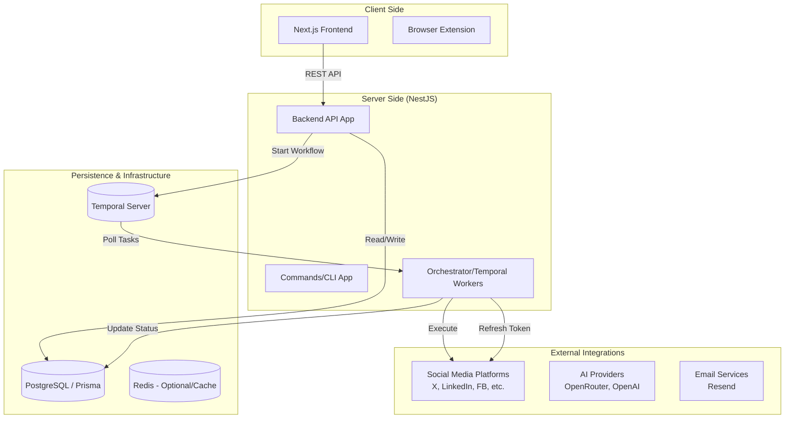

# Postiz (formerly Gitroom) Development Design Document

## 1. Project Overview
Postiz is an open-source social media management and scheduling tool designed to provide features similar to Buffer and Hypefury. It integrates AI-assisted creation, multi-platform scheduling, team collaboration, and data analytics.

### Core Tech Stack
- **Monorepo Management**: `pnpm workspaces`
- **Backend**: `NestJS` (Node.js framework)
- **Frontend**: `Next.js` (React framework)
- **Task Orchestration**: `Temporal` (Distributed workflow engine)
- **Database ORM**: `Prisma` (PostgreSQL by default)
- **Communication**: `REST API` & `Temporal Workflows`
- **Third-party Integration**: OAuth 2.0, API Key

---

## 2. System Architecture



---

## 3. Core Business Flow (Posting Process)

```mermaid
flowchart TD
    A[User creates post in frontend] --> B[Backend validates and saves to DB]
    B --> C{Post immediately?}
    C -- No --> D[Start Temporal Workflow<br/>(Wait state)]
    C -- Yes --> E[Start Temporal Workflow<br/>(Execute immediately)]
    
    D --> F[Workflow wakes up at scheduled time]
    E --> G[Activity: Call Social Platform API]
    F --> G
    
    G --> H{Token expired?}
    H -- Yes --> I[Activity: Auto Refresh Token]
    I --> G
    
    H -- No --> J{Success?}
    J -- No --> K[Exponential Backoff Retry]
    J -- Yes --> L[Update DB Status &<br/>Send Notification]
    
    L --> M[Execute Follow-up: Comments/Reposts/Plugs]
```

---

## 4. Social Platform Integration Design

Postiz uses a highly abstracted interface design, making it easy to extend new platforms.

### 4.1 Core Interface: `SocialProvider`
All platform integrations are defined under `libraries/nestjs-libraries/src/integrations/social` and implement the `SocialProvider` interface.

- **IAuthenticator**: Handles authentication (OAuth flows, Token refresh).
- **ISocialMediaIntegration**: Handles core business logic (`post`, `comment`).

### 4.2 Integrated Platforms (30+)
| Category | Examples |
| :--- | :--- |
| **Mainstream Social** | X (Twitter), Facebook, Instagram, LinkedIn, Threads, TikTok, Pinterest |
| **Community & Content** | Reddit, YouTube, Mastodon, Bluesky, Discord, Slack, Telegram |
| **Tech Blogs** | Dev.to, Hashnode, Medium, WordPress |
| **Developer Platforms** | Dribbble, Farcaster, Nostr, VK |
| **Others** | Google Business Profile (GMB), Twitch, Kick, Lemmy |

---

## 5. Task Orchestration & Reliability (Temporal)

The core competitiveness of Postiz lies in its use of `Temporal`, which ensures high availability for posting tasks:
- **State Persistence**: Even if the server restarts, the workflow continues from the last checkpoint.
- **Flexible Scheduling**: Posts can be scheduled to any point in the future using `Workflow.sleep`.
- **Retry Mechanism**: Handles platform API rate limits or network fluctuations with automatic retries.
- **Complex Logic**: Easily handles sequences like "Auto-post the first comment 10 minutes after the main post is successful."

---

## 6. Data Model Design (Core Entities)

| Entity | Description |
| :--- | :--- |
| **Organization** | The core of multi-tenant logic for teams. |
| **Integration** | Stores connected social account info (Encrypted Tokens, Provider Type). |
| **Post** | Post content, media assets, schedule time, and status (DRAFT/QUEUE/SENT/ERROR). |
| **Channel** | Channel info, defining platform-specific configurations for different integrations. |
| **User** | System users and permissions. |

---

## 7. Key Modules

### 7.1 AI Assistance System
Integrates **OpenRouter** and local AI logic to support:
- Automatic tweet/post generation.
- Content polishing and formatting.
- Multi-language translation.

### 7.2 Plugin System (Plugs)
- **Internal Plugs**: Automatic reposts/likes by internal organization members.
- **Global Plugs**: Trigger automatic replies when specific conditions (e.g., like count) are met.

---

## 8. Development Suggestions
1. **Local Environment**: Requires PostgreSQL and Temporal Server (can be started via provided `docker-compose`).
2. **Schema Changes**: After modifying `schema.prisma`, run `pnpm run prisma-db-push`.
3. **Adding Platforms**: Create a new `.provider.ts` in `nestjs-libraries/integrations/social` and implement the required interfaces.
