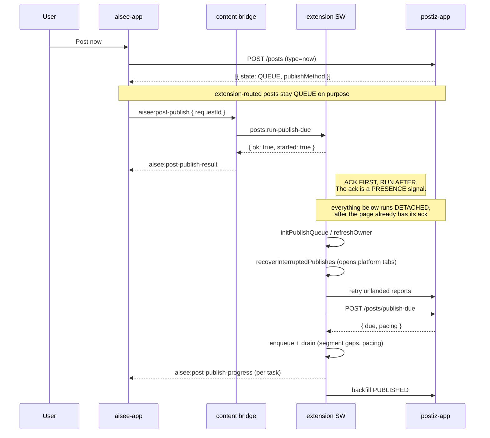
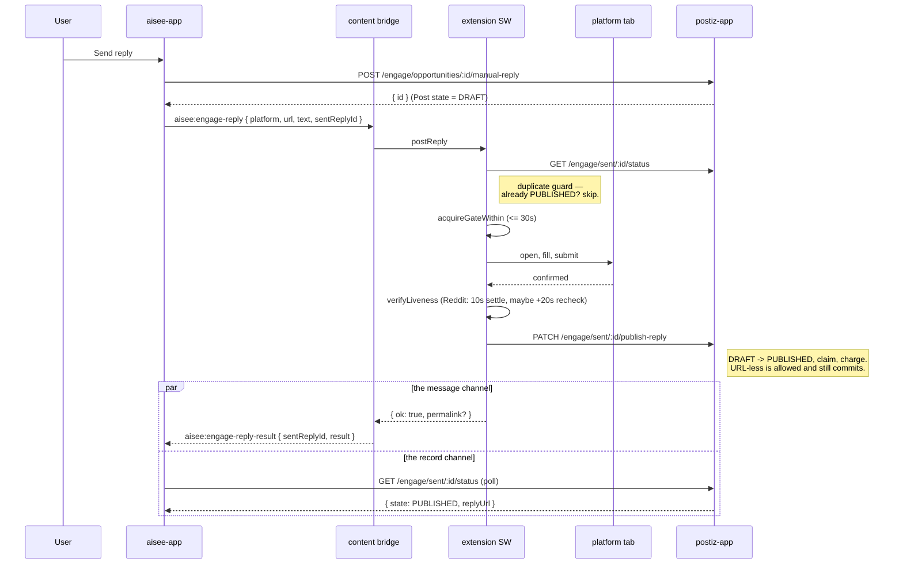
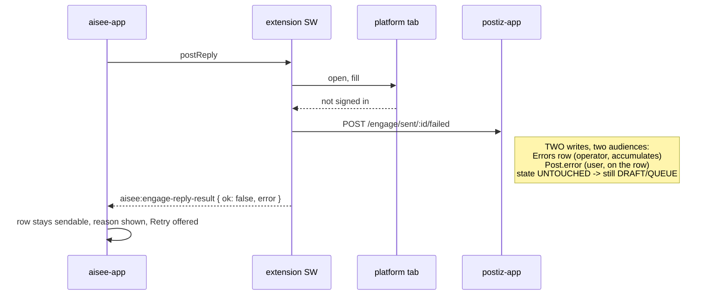
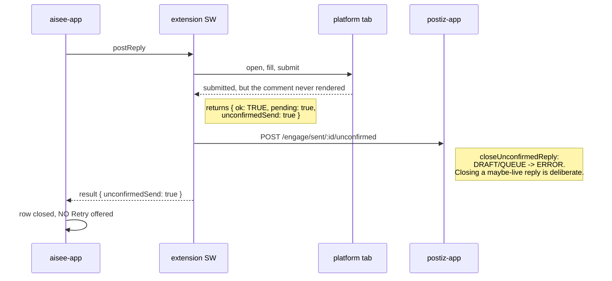
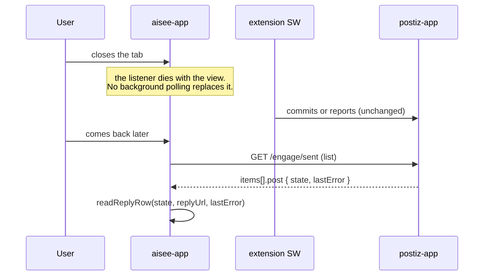

# Extension Reply Outcome Protocol (three repos)

How a reply posted **in the user's own browser** reports what happened, across
`aisee-app` (the page), `aisee-browser-extension` (the poster) and `postiz-app`
(the record) — and the code `aisee-app` still has to adopt.

**Audience:** Dev / Frontend. **Status:** backend + extension landed
(2026-09-23); the `aisee-app` half in §6 is not applied yet.

---

## 1. The failure this documents

Users reported that posting and replying through the extension "sometimes fails"
in `aisee-app` while the post actually went out. Four independent defects, one
shape: **the page treated the absence of a confirmation as a failure.**

| # | Where | Defect |
|---|-------|--------|
| 1 | `aisee-app` publish trigger | 10s ack window vs a pull that opens platform tabs; a healthy extension was reported as "didn't respond" |
| 2 | `aisee-app` reply poll | 20s deadline vs an extension budget of 30s gate + 20s tab load + 10s liveness settle |
| 3 | `aisee-app` reply poll | resolved only on `replyUrl`; a URL-less `PUBLISHED` commit (every LinkedIn comment) waited forever |
| 4 | `aisee-app` reply poll | listener reacted only to `ok === false`, so the extension's later success was discarded |

There is **no internal retry**. The extension answers once, and that answer is
final for that attempt. What varied was only *when* it answered.

### 1.1 Why no fixed timeout can be correct

An attended reply is bounded at roughly a minute today, but nothing in the page
can know that, and nothing keeps it true. The queued tracks legitimately wait
**minutes to hours** — per-platform write pacing is 15–45 min on
reddit/hackernews, 30–60 on medium/devto, and operator-configurable up to 6h
(`libraries/helpers/src/extension/platform-pacing.ts`), plus a clock-time
`window`.

So the page must stop *waiting* rather than wait longer. Its spinner is a
courtesy, not a verdict.

---

## 2. Three repos, two channels of truth

| Repo | Role | Owns |
|------|------|------|
| `aisee-app` | the page | the spinner, the row's rendering, whether a Retry button is offered |
| `aisee-browser-extension` | the poster | the platform tab, the write gate, the verdict for one attempt |
| `postiz-app` | the record | `Post.state` (is this row sendable), `Post.error` (why the last attempt failed) |

Two channels carry an outcome, and they are **not** interchangeable:

- **`window.postMessage`** — `aisee:engage-reply-result`, one per attempt. Carries
  the full verdict (every flag in §5). Ephemeral: it exists only while the page
  is open, and nothing replays it.
- **the record** — durable. Success is observable (`state: PUBLISHED`). Failure
  is observable *only since this change*: `POST /engage/sent/:id/failed` used to
  write an `Errors` row and nothing else, leaving the record a `DRAFT`
  indistinguishable from one the user never sent.

**Rule:** the message is the only place a failure's *reason* is fully expressed;
the record is the only thing that survives the page closing. A client needs both,
and must never read silence as either outcome.

---

## 3. Sequence diagrams

### 3.1 Publish — a pure sync trigger

The page commits to the DB first; the message only makes the extension pull
*now* instead of on its 1-minute poll. Correctness never depends on it.



Before the fix, `sendResponse` waited for that whole pull. The page's 10s ack
expired and it showed *"the aisee extension didn't respond"* — while the posts
went out seconds later.

### 3.2 Reply — success



Note the two racing paths. Either settles the spinner; `replyUrl` may be `null`
on a platform that confirms a send but yields no permalink, and **that is still a
success**.

### 3.3 Reply — a failure that leaves the row sendable

Signed out, network, rate limited, a selector that moved. Nothing reached the
platform.



`state` must not move here. `claimDueEngageReplies` requires `post.state:
'QUEUE'`, so closing a queued row would permanently kill the unattended retry —
exactly what the name `logRetryableFailure` promises not to do. An attended row
is `DRAFT` and has no automatic retry at all, so closing it would only take it
out of the user's Drafts and claim the matter is settled.

### 3.4 Reply — an unconfirmed send (the row is CLOSED)

The send fired and its result could not be read back. The reply may be live.



Two things here were broken until 2026-09-23 and are worth remembering:

- The result carries **`ok: true`**, so every branch in `handlePostReply` gated on
  `!result.ok` skipped it, and the commit block (gated on `ok && !pending`)
  skipped it too. The attended route reported *nothing*.
- `closeUnconfirmedReply`'s where-clause named `state: 'QUEUE'` alone. Attended
  records are `DRAFT`, so even once reported it would have closed nothing.

Closing is recoverable: `utils/reply.unconfirmed.ts` looks each closed row up on
the platform by its own text and commits the ones that landed —
`publishExtensionReply` does not gate on the record's state, so `ERROR →
PUBLISHED` works.

### 3.5 The user leaves and comes back

Leaving **is** the decision not to wait. Nothing outlives the view; both outcomes
are durable, so re-entry is a plain read.



---

## 4. Record semantics: `state` x `lastError`

`lastError` is **only ever interpreted through `state`**. Read alone it reports a
live reply as failed — the defect this whole protocol came from.

| `state` | `lastError` | Meaning | Retry? |
|---------|-------------|---------|--------|
| `DRAFT` / `QUEUE` | null | never attempted | yes |
| `DRAFT` / `QUEUE` | set | still sendable; this is what went wrong | yes |
| `PUBLISHED` + `replyUrl` | — | live, with a permalink | no |
| `PUBLISHED`, no `replyUrl` | — | **live** (LinkedIn comments never yield one) | no |
| `ERROR` | set | closed, and the only reason a reply is closed is "must not be re-sent" | **no** |

Three paths close a reply, and none of them means "it failed":
`closeUnconfirmedReply`, `markOpportunityTargetGone`,
`markOpportunityRepliesDisabled`.

`lastError` is cleared by `updateReplyUrl` (a commit, either path) and by
`upsertDraft` (the draft was edited, so the old reason describes text that no
longer exists).

**No timestamp rides with it.** `Post.updatedAt` is the obvious candidate and it
is wrong: it is `@updatedAt`, so on a `QUEUE` row every lease hand-out
(`claimDueEngageReplies` stamps `claimedAt`/`releaseId`) moves it, and a failure
from forty minutes ago would read "just now". Exact per-attempt times live in the
`Errors` table.

---

## 5. Attempt flags: the verdict table

The extension reports far more than success/failure, and the difference between
its failures is the difference between "press it again" and "do NOT press it
again". A surface that offers Retry on `pending` or `unconfirmedSend` is offering
to double-post.

| Flag on `result` | Meaning | Published? | Retry? |
|------------------|---------|-----------|--------|
| `ok: true` (no `pending`) | live, record committed | yes | — |
| `alreadyPublished` | the duplicate guard found it already live — **a success** (`ok` is `false` on this result) | yes | no |
| `removed` | posted, then taken down by the platform | no | no |
| `unconfirmedSend` | fired, result unreadable; may be live | no | **no** |
| `pending` | composer filled, platform never confirmed | no | **no** |
| `targetGone` / `repliesDisabled` | the post is gone / accepts no replies | no | no |
| `busy` / `paced` | nothing was attempted, no tab opened | no | yes, freely |
| anything else | ordinary and transient | no | yes |

`alreadyPublished` is the one that silently mattered: it arrives with `ok:
false`, so reading `ok` alone rendered a **successful** reply as a failure.

---

## 6. `aisee-app` — the code to adopt

Not applied yet. Three new/replaced files plus two call sites.

| File | Path |
|------|------|
| new | `app/(pages)/engage/_lib/reply-attempt-verdict.ts` |
| replace | `app/(pages)/engage/_lib/poll-reply-status.ts` |
| new | `app/(pages)/engage/_hooks/use-extension-reply-events.ts` |

### 6.1 Types

`app/(pages)/engage/_lib/types.ts` — add `lastError` to the status shape, and to
the sent-list item's `post`:

```ts
export interface EngageSentReplyStatus {
    id: string;
    state: string | null;
    replyUrl: string | null;
    /** Why the last attempt did not go out. Read ONLY through `state`. */
    lastError?: string | null;
    targetUrl?: string | null;
    error?: string;
}
```

### 6.2 `reply-attempt-verdict.ts` (new)

The single place that reads the extension's flags, and the single place that
decides whether Retry may be offered. Pure — worth a table-driven test.

```ts
// What one in-browser reply attempt actually means — the single place that reads
// the extension's result flags, and the single place that decides whether the
// user may press send again.
//
// WHY THIS IS NOT `if (ok)`
// -------------------------
// The extension reports far more than success/failure, and the difference
// between its failures is the difference between "press it again" and "do NOT
// press it again":
//
//   busy / paced        nothing was sent, no tab was even opened → retry freely
//   pending             the composer was filled, the platform never confirmed →
//                       the draft is sitting in a real tab; sending again posts
//                       a second copy of a comment that may be one click away
//   unconfirmedSend     the send FIRED and the result could not be read → the
//                       reply may well be live; this is the one that produced
//                       the triple-comment incident
//   targetGone /        the post is deleted, or accepts no replies → retrying
//   repliesDisabled     cannot ever work, and each try costs a platform write
//   alreadyPublished    NOT a failure at all: the extension's own duplicate
//                       guard found the reply already live and declined to send
//                       a second one. `ok` is false on this result, which is why
//                       reading `ok` alone reported a SUCCESSFUL reply as failed.
//   anything else       ordinary and transient (signed out, network, rate
//                       limited, a selector that moved) → retry freely
//
// So `retryable` here is a safety verdict, not a UI convenience: a surface that
// offers Retry on `unconfirmedSend` or `pending` is offering to double-post.

/** The `result` object the extension bridge posts back. */
export type ExtensionReplyResult = {
    ok?: boolean;
    pending?: boolean;
    busy?: boolean;
    paced?: boolean;
    alreadyPublished?: boolean;
    targetGone?: boolean;
    repliesDisabled?: boolean;
    unconfirmedSend?: boolean;
    removed?: boolean;
    removedVerdict?: "removed" | "gone";
    permalink?: string;
    error?: string;
    message?: string;
};

export type ReplyAttemptVerdict = {
    /** The reply is live on the platform (the record is committed, or already was). */
    published: boolean;
    /** Present only when the platform yielded one — many platforms do not. */
    permalink?: string;
    /** May the user send this draft again? See the header: this is a safety call. */
    retryable: boolean;
    /** Nothing reached the platform at all — safe to retry immediately, no pacing owed. */
    untouched: boolean;
    /** What to show. Empty string when there is nothing to say (a clean success). */
    reason: string;
    /**
     * Why it is not retryable, for surfaces that want to explain the missing
     * button rather than just hide it.
     */
    blocked?: "pending-composer" | "unconfirmed" | "target-gone" | "replies-disabled" | "removed";
};

const FALLBACK = "The extension couldn't post your reply. Please try again.";

export function readReplyAttempt(result: ExtensionReplyResult): ReplyAttemptVerdict {
    const reason = result.error || result.message || "";

    // Success first, including the duplicate guard's "it was already there".
    if (result.ok === true && !result.pending) {
        return { published: true, permalink: result.permalink, retryable: false, untouched: false, reason: "" };
    }
    if (result.alreadyPublished) {
        return {
            published: true,
            permalink: result.permalink,
            retryable: false,
            untouched: true,
            reason: reason || "This reply was already published — nothing was sent again."
        };
    }

    // Posted, then taken down by the platform. Published in the sense that it
    // went out; retrying sends the same content into the same rule that just
    // removed it.
    if (result.removed) {
        return {
            published: false,
            retryable: false,
            untouched: false,
            reason: reason || "Posted, then removed by the platform.",
            blocked: "removed"
        };
    }

    // The three "do not press it again" failures.
    if (result.unconfirmedSend) {
        return {
            published: false,
            retryable: false,
            untouched: false,
            reason:
                reason ||
                "We sent it but couldn't read the platform's confirmation. Check the post before sending again.",
            blocked: "unconfirmed"
        };
    }
    if (result.pending) {
        return {
            published: false,
            retryable: false,
            untouched: false,
            reason: reason || "The reply is waiting in the platform's own composer — finish it in that tab.",
            blocked: "pending-composer"
        };
    }
    if (result.targetGone || result.repliesDisabled) {
        return {
            published: false,
            retryable: false,
            untouched: true,
            reason:
                reason ||
                (result.targetGone ? "That post no longer exists." : "That post doesn't accept replies."),
            blocked: result.targetGone ? "target-gone" : "replies-disabled"
        };
    }

    // Nothing was attempted: the browser was finishing another platform write,
    // or pacing held this one back. Not a failure of the reply in any sense.
    if (result.busy || result.paced) {
        return {
            published: false,
            retryable: true,
            untouched: true,
            reason: reason || "The browser was busy with another platform write — nothing was sent."
        };
    }

    // Ordinary and transient. The row stays sendable; the reason is worth showing.
    return { published: false, retryable: true, untouched: false, reason: reason || FALLBACK };
}

// ── The other half: what a ROW means when read back from the DB ──────────────

/**
 * How a sent-reply row reads on its own, with no live attempt in hand — the
 * path someone takes when they leave the page and come back.
 *
 * `lastError` is only ever interpreted THROUGH `state`, never on its own:
 *   DRAFT/QUEUE + lastError → still sendable, and this is what went wrong
 *   DRAFT/QUEUE, no error   → never attempted
 *   PUBLISHED               → live (with or without a permalink)
 *   ERROR                   → closed; lastError is what closed it, and the only
 *                             thing that closes a reply is "must not be re-sent"
 */
export type ReplyRowStatus = "published" | "awaiting-link" | "sending-or-idle" | "closed" | "unknown";

export function readReplyRow(row: {
    state?: string | null;
    replyUrl?: string | null;
    lastError?: string | null;
}): { status: ReplyRowStatus; reason: string; retryable: boolean } {
    const reason = row.lastError || "";
    switch (row.state) {
        case "PUBLISHED":
            // No permalink is a normal published state on several platforms
            // (a LinkedIn comment never yields one), not a half-finished send.
            return { status: row.replyUrl ? "published" : "awaiting-link", reason: "", retryable: false };
        case "DRAFT":
        case "QUEUE":
            return { status: "sending-or-idle", reason, retryable: true };
        case "ERROR":
            // Closed by one of the three "must not be re-sent" paths
            // (unconfirmed send, target gone, replies disabled).
            return { status: "closed", reason, retryable: false };
        default:
            return { status: "unknown", reason, retryable: false };
    }
}
```

### 6.3 `poll-reply-status.ts` (replace)

```ts
// Watch one sent reply while the browser extension posts it in-browser.
//
// WHY THIS IS NOT A TIMEOUT ANY MORE
// ----------------------------------
// The old shape — "wait 20s, then declare failure" — encoded a guess about the
// extension's internals as a verdict about the user's reply. The extension is
// browser automation behind a browser-wide write gate: it waits up to 30s for
// that gate, up to 20s for the platform tab to load, and (Reddit) another 10s
// liveness settle plus a possible 20s re-check BEFORE it commits the record. A
// reply that went out perfectly was therefore routinely reported as "timed
// out". Raising the number would only move the lie: the attended path is
// bounded today at roughly a minute, but nothing here can know that, and the
// queued/unattended tracks legitimately wait MINUTES TO HOURS (per-platform
// write pacing is 15-45 min on reddit/hackernews, operator-configurable to 6h).
//
// So the window below is not a deadline. It is only how long the send button
// keeps a spinner up. Reaching it means UNKNOWN YET — `ReplyStillPostingError`
// — never "failed".
//
// WHAT HAPPENS WHEN THE USER LEAVES
// ---------------------------------
// Nothing, deliberately. Leaving the page IS the decision not to wait: the
// listener dies with the view and no background polling replaces it. The record
// is not lost, because both outcomes are now durable server-side —
//   success → the extension PATCHes publish-reply itself: state PUBLISHED
//   failure → `/sent/:id/failed` writes the reason onto the row (Post.error)
//             WITHOUT closing it: state stays DRAFT/QUEUE, still sendable
// — so re-entry just reads the row. See readReplyRow in reply-attempt-verdict.

import { pingExtension } from "@/app/_lib/extension-debug";
import { engageApi } from "./api";
import { readReplyAttempt, type ExtensionReplyResult, type ReplyAttemptVerdict } from "./reply-attempt-verdict";

/**
 * The attempt is over and the reply did not go out. `verdict.retryable` says
 * whether the caller may offer to send again — several failures here mean the
 * opposite, see reply-attempt-verdict.
 */
export class ReplyExtensionError extends Error {
    readonly verdict: ReplyAttemptVerdict;
    constructor(verdict: ReplyAttemptVerdict) {
        super(verdict.reason);
        this.name = "ReplyExtensionError";
        this.verdict = verdict;
    }
}

/**
 * The grace window closed with no verdict — NOT a failure. The extension is
 * still working (or queued behind another platform write). Render this as
 * "still posting" and do NOT offer to send again: that is how duplicate
 * comments happen. The row settles itself — from the extension's late result
 * while the view is open, or from the DB on the next read.
 */
export class ReplyStillPostingError extends Error {
    constructor(message: string) {
        super(message);
        this.name = "ReplyStillPostingError";
    }
}

// Result message the extension posts back. These MUST match the extension's
// EXTENSION_MESSAGE.resultSource / engageReplyResult (postiz-app:
// libraries/helpers/src/extension/brand.ts), same as the page → extension
// constants in extension-reply.ts.
export const REPLY_RESULT_SOURCE = "aisee-extension";
export const REPLY_RESULT_ACTION = "aisee:engage-reply-result";

const STILL_POSTING_MESSAGE =
    "Still posting in the background. This reply updates here on its own — don't send it again.";
const NOT_DETECTED_MESSAGE =
    "The aisee extension didn't respond, so nothing was sent. Install or enable it, keep this browser open, and try again.";
const STALE_BRIDGE_MESSAGE = "The extension was reloaded. Refresh this page and try again.";

export type ExtensionReplyMessage = {
    source?: string;
    action?: string;
    opportunityId?: string;
    /** Added by the extension bridge so one opportunity's attempts stay distinct. */
    sentReplyId?: string;
    result?: ExtensionReplyResult;
};

// Poll cadence: tight at first (a dev.to or X reply can confirm in seconds),
// then slower.
const POLL_INTERVAL_MS = 1000;
const SLOW_POLL_AFTER_MS = 15_000;
const SLOW_POLL_INTERVAL_MS = 5_000;
// How long the send button keeps a spinner up. Not a deadline — see the header.
const GRACE_WINDOW_MS = 45_000;

const delay = (ms: number) => new Promise<void>((resolve) => setTimeout(resolve, ms));

/**
 * Records an inline wait is currently responsible for.
 *
 * useExtensionReplyEvents handles LATE results — every result for a record
 * nobody is still watching. Without this the two would both act on a result
 * that arrives inside the grace window, writing the permalink twice and showing
 * the same failure in two places.
 */
const awaitingInline = new Set<string>();

/** Is an inline `pollReplyPosted` still responsible for this record? */
export function isReplyAwaitedInline(sentReplyId: string): boolean {
    return awaitingInline.has(sentReplyId);
}

/** Read one extension result message, or undefined when it isn't ours / isn't one. */
export function readReplyResultMessage(
    event: MessageEvent,
    match?: { sentReplyId: string; opportunityId: string }
): ExtensionReplyMessage | undefined {
    if (typeof window === "undefined") return undefined;
    if (event.source !== window) return undefined;
    if (event.origin !== window.location.origin) return undefined;
    const data = event.data as ExtensionReplyMessage | undefined;
    if (!data || data.source !== REPLY_RESULT_SOURCE || data.action !== REPLY_RESULT_ACTION) return undefined;
    if (!data.result) return undefined;
    if (!match) return data;
    // Correlate by sentReplyId when the extension sends one (it does since the
    // bridge started echoing it) and by opportunityId otherwise, so an older
    // extension still works: one opportunity can carry several attempts, and
    // matching only the opportunity lets a slow earlier attempt settle the wait
    // for the reply the user is actually watching.
    if (data.sentReplyId) return data.sentReplyId === match.sentReplyId ? data : undefined;
    return data.opportunityId === match.opportunityId ? data : undefined;
}

/** Settle as soon as the extension reports THIS record's outcome. */
function waitForExtensionResult(
    sentReplyId: string,
    opportunityId: string
): { promise: Promise<string>; cleanup: () => void } {
    if (typeof window === "undefined") {
        return { promise: new Promise<string>(() => {}), cleanup: () => {} };
    }
    let cleanup = () => {};
    const promise = new Promise<string>((resolve, reject) => {
        const onMessage = (event: MessageEvent) => {
            const data = readReplyResultMessage(event, { sentReplyId, opportunityId });
            if (!data?.result) return;
            const verdict = readReplyAttempt(data.result);
            // `published` covers alreadyPublished too — the duplicate guard
            // declining to send a second copy is a success, and reading `ok`
            // alone is what used to report it as a failure.
            if (verdict.published) resolve(verdict.permalink ?? "");
            else reject(new ReplyExtensionError(verdict));
        };
        window.addEventListener("message", onMessage);
        cleanup = () => window.removeEventListener("message", onMessage);
    });
    return { promise, cleanup };
}

/**
 * Fail fast when no extension is listening.
 *
 * Nothing sends the reply if the bridge is absent, so this is the one case that
 * IS knowable immediately — and the only reason the grace window can stay
 * generous without leaving someone watching a spinner for nothing.
 */
async function requireExtension(): Promise<void> {
    const notInstalled = (reason: string) =>
        new ReplyExtensionError({ published: false, retryable: true, untouched: true, reason });
    try {
        const { stale } = await pingExtension();
        if (stale) throw notInstalled(STALE_BRIDGE_MESSAGE);
    } catch (e) {
        if (e instanceof ReplyExtensionError) throw e;
        throw notInstalled(NOT_DETECTED_MESSAGE);
    }
}

async function pollUntilPublished(sentReplyId: string): Promise<string> {
    const startedAt = Date.now();
    const deadline = startedAt + GRACE_WINDOW_MS;
    while (Date.now() < deadline) {
        await delay(Date.now() - startedAt < SLOW_POLL_AFTER_MS ? POLL_INTERVAL_MS : SLOW_POLL_INTERVAL_MS);
        const res = await engageApi.getSentReplyStatus(sentReplyId);
        // Transient request error → keep polling until the window closes.
        if ("error" in res && res.error) continue;
        if (res.replyUrl) return res.replyUrl;
        // PUBLISHED with no url is a SUCCESS, not a pending state. The extension
        // commits url-less on purpose when the platform confirms the send but
        // yields no permalink (a LinkedIn comment never does) — leaving the row
        // in DRAFT would invite a duplicate re-send. Waiting for a url that is
        // never coming was reported to the user as a failed reply that was in
        // fact live.
        if (res.state === "PUBLISHED") return "";
    }
    throw new ReplyStillPostingError(STILL_POSTING_MESSAGE);
}

/**
 * Resolves with the reply permalink once confirmed (empty string = live but the
 * platform gave no permalink).
 *
 * Throws `ReplyExtensionError` for a real verdict — read `.verdict.retryable`
 * before offering to send again — and `ReplyStillPostingError` when the grace
 * window closed with no verdict, which the caller renders as "still posting".
 */
export async function pollReplyPosted(sentReplyId: string, opportunityId: string): Promise<string> {
    // Listener first: the extension can answer while the presence probe is still
    // in flight, and a result that lands before we are listening is lost.
    const extensionResult = waitForExtensionResult(sentReplyId, opportunityId);
    awaitingInline.add(sentReplyId);
    try {
        await requireExtension();
        return await Promise.race([pollUntilPublished(sentReplyId), extensionResult.promise]);
    } finally {
        awaitingInline.delete(sentReplyId);
        extensionResult.cleanup();
    }
}
```

### 6.4 `use-extension-reply-events.ts` (new)

```ts
"use client";

import { useEffect, useRef } from "react";

import { isReplyAwaitedInline, readReplyResultMessage } from "../_lib/poll-reply-status";
import { readReplyAttempt, type ReplyAttemptVerdict } from "../_lib/reply-attempt-verdict";

// Late outcomes for in-browser replies — the reply counterpart of
// useExtensionPublishEvents.
//
// The extension posts exactly ONE result per reply, whenever it finishes. How
// long that takes is not the page's to predict: the send sits behind a
// browser-wide write gate (one platform tab at a time), the platform tab itself
// can take 20s to load, and Reddit adds a liveness settle before the record is
// committed. A listener that lives only for the duration of the send button's
// spinner therefore misses the answer and leaves the user looking at a failure
// that never happened.
//
// So this one lives as long as the VIEW does — and no longer. Leaving the page
// is the user's decision not to wait, and nothing here tries to outlive that:
// both outcomes are durable server-side (PUBLISHED on success, Post.error on a
// failed attempt with the row left sendable), so re-entry reads the row instead.
//
// It handles the results nobody is waiting for any more; a result that arrives
// while pollReplyPosted is still responsible for that record belongs to the
// inline path and is skipped here (isReplyAwaitedInline), so the two can never
// both write the same row.

export type ExtensionReplyOutcome = {
    /** Present since the extension bridge started echoing it. */
    sentReplyId?: string;
    opportunityId?: string;
    /**
     * The full reading of the attempt — `published`, `retryable`, `reason` and
     * `blocked`. Read `retryable` before offering to send again: `pending` and
     * `unconfirmedSend` both mean a second send would post a duplicate.
     */
    verdict: ReplyAttemptVerdict;
};

/** Subscribe to reply outcomes the inline wait did not catch. Fires once per reply. */
export function useExtensionReplyEvents(onSettled: (outcome: ExtensionReplyOutcome) => void, enabled = true): void {
    const callbackRef = useRef(onSettled);
    callbackRef.current = onSettled;

    useEffect(() => {
        if (!enabled || typeof window === "undefined") return;
        // One result per record, even if the extension ever repeats itself.
        const seen = new Set<string>();

        const onMessage = (event: MessageEvent) => {
            const data = readReplyResultMessage(event);
            if (!data?.result) return;
            const sentReplyId = data.sentReplyId;
            // An inline wait owns this record right now — let it answer.
            if (sentReplyId && isReplyAwaitedInline(sentReplyId)) return;
            const key = sentReplyId || data.opportunityId;
            if (key) {
                if (seen.has(key)) return;
                seen.add(key);
            }
            callbackRef.current({
                sentReplyId,
                opportunityId: data.opportunityId,
                verdict: readReplyAttempt(data.result)
            });
        };

        window.addEventListener("message", onMessage);
        return () => window.removeEventListener("message", onMessage);
    }, [enabled]);
}
```

### 6.5 Call site — `engage-sent-view.tsx`

Send (~line 1179):

```tsx
try {
    const replyUrl = await pollReplyPosted(res.id, item.opportunityId);
    if (replyUrl) {
        await updateReplyUrl(res.id, replyUrl);
        refreshAwaitingReviewCounts();
    } else void refreshSentReplyItem(res.id);
} catch (e) {
    // No verdict yet is NOT a failure. The row stays pending; a late result is
    // settled by useExtensionReplyEvents.
    if (e instanceof ReplyStillPostingError) {
        showInfoToast("Still posting", e.message);
        void refreshSentReplyItem(res.id);
        return;
    }
    if (e instanceof ReplyExtensionError) {
        void refreshSentReplyItem(res.id);
        showErrorToast(e.verdict.retryable ? "Reply not sent" : "Can't send this reply", e.message);
        return;
    }
    throw e;
}
```

View-level listener, after the `useEngageSent(...)` destructure:

```tsx
useExtensionReplyEvents(
    useCallback(
        ({ sentReplyId, verdict }) => {
            if (!sentReplyId) return;
            if (verdict.published) {
                if (verdict.permalink) void updateReplyUrl(sentReplyId, verdict.permalink);
                else void refreshSentReplyItem(sentReplyId);
                refreshAwaitingReviewCounts();
                return;
            }
            // Not sent. The row is still DRAFT (the backend wrote Post.error and
            // left it open), so re-reading it surfaces the reason on the row.
            void refreshSentReplyItem(sentReplyId);
            showErrorToast(verdict.retryable ? "Reply not sent" : "Can't send this reply", verdict.reason);
        },
        [updateReplyUrl, refreshSentReplyItem, refreshAwaitingReviewCounts]
    )
);
```

Row rendering — what someone sees on re-entry (§3.5):

```tsx
const row = readReplyRow({
    state: item.post.state,
    replyUrl: item.post.releaseURL,
    lastError: item.post.lastError
});

// "sending-or-idle" + reason  -> caption "Last attempt: {reason}" + Retry
// "sending-or-idle", no reason -> an ordinary draft, say nothing
// "closed"                     -> show the reason, NO Retry
// "awaiting-link"              -> published without a permalink; existing flow
```

### 6.6 Call site — `engage-signal-feed-view.tsx`

Send (~line 1655):

```tsx
try {
    const replyUrl = await pollReplyPosted(res.id, item.id);
    pendingSentReplyRef.current = null;
    // "" = published but the platform gave no permalink. Do not write an empty
    // link; REPLIED is the whole story.
    if (replyUrl) setReplyLink(item.id, replyUrl);
    markReplied(item.id, "REPLIED");
} catch (e) {
    if (e instanceof ReplyStillPostingError) {
        // Stay REPLY_PENDING; keep pendingSentReplyRef; do not surface an error.
        return;
    }
    throw e;
}
```

```tsx
useExtensionReplyEvents(
    useCallback(
        ({ opportunityId, verdict }) => {
            if (!opportunityId) return;
            if (verdict.published) {
                if (verdict.permalink) setReplyLink(opportunityId, verdict.permalink);
                markReplied(opportunityId, "REPLIED");
                return;
            }
            markReplied(opportunityId, "NOT_REPLIED"); // this project's "not replied" value
            showErrorToast(verdict.retryable ? "Reply not sent" : "Can't send this reply", verdict.reason);
        },
        [setReplyLink, markReplied]
    )
);
```

This view indexes rows by `opportunityId`, so the callback keys off that;
`sentReplyId` is only for de-duplication and ownership.

### 6.7 What adopting this fixes

- `alreadyPublished` was rendered as a failure — it is a success.
- URL-less success wrote an empty link (`setReplyLink(id, "")`).
- `busy` / `paced` looked identical to a real failure; they mean *nothing
  happened*.
- The 20s deadline reported live replies as timed out.

---

## 7. What already landed

### postiz-app

| Change | Where |
|--------|-------|
| `recordReplyAttemptFailure` — writes `Post.error`, **never** `state`; where-clause `state: { in: ['DRAFT','QUEUE'] }` | `engage.repository.ts` |
| `reportReplyFailed` — two writes: `logRetryableFailure` (operator) + `recordReplyAttemptFailure` (user) | `engage.service.ts` |
| `getSentReplyStatus` returns `lastError` | `engage.repository.ts` |
| `listSentReplies` + `getSentReplyItemById` return `post.lastError` | `engage.repository.ts` |
| `updateReplyUrl` clears `error` on both commit paths | `engage.repository.ts` |
| `upsertDraft` clears `error` when the draft is edited | `engage.repository.ts` |
| `closeUnconfirmedReply` widened to `DRAFT` + `QUEUE` (attended records are DRAFT) | `engage.repository.ts` |

Tests: `__tests__/engage-repository-reply-attempt-failure.spec.ts` (9) and the
updated `engage-repository-target-gone.spec.ts`.

### aisee-browser-extension

| Change | Where |
|--------|-------|
| `posts:run-publish-due` acks immediately; the pull runs detached | `pages/background/index.ts` |
| `aisee:engage-reply-result` carries `sentReplyId` | `pages/content/browser-assisted-reply.ts` |
| `reportReplyUnconfirmed` — every route reports an unconfirmed send, not just the driver | `pages/background/post-reply.ts` |

---

## 8. Invariants

For anyone touching this again:

1. **A failure report never writes `state`.** Closing a `QUEUE` row removes it
   from `claimDueEngageReplies` for good.
2. **Only "must not be re-sent" closes a reply** — not "it failed".
3. **`lastError` is read through `state`,** never alone.
4. **`PUBLISHED` without a `replyUrl` is a success.**
5. **The page's wait window is not a verdict.** Reaching it means *unknown yet*.
6. **Read the flags, not `ok`.** `alreadyPublished` is a success with
   `ok: false`; `unconfirmedSend` is a non-retryable outcome with `ok: true`.

---

## See also

- [`../extension-reply-and-auth.md`](../extension-reply-and-auth.md) — how the
  extension authenticates and which frontend owns which session.
- [`../extension-post-publish-protocol.md`](../extension-post-publish-protocol.md)
  — the publish queue's own message protocol.
- [`write-path-limits.md`](./write-path-limits.md) — what bounds how much a
  subscriber may write.
