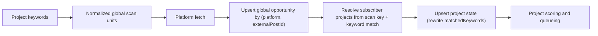

# Project-Scoped Post and Engage Implementation

**Status:** Proposed  
**Owner:** Postiz  
**External project source:** `../aisee-core`  
**Full cross-system design :** [aisee-core document](../../aisee-core/docs/project-scoped-post-engage-design.md)

## 1. Scope

This document is the Postiz implementation specification for project-scoped Post and Engage behavior. It intentionally excludes the complete product rationale and Aisee operating plan.

The core contract is:

- `projectId` is an opaque reference to `aisee-core.products.id`;
- `aisee-core` remains the source of truth for project identity and ownership;
- Postiz stores project attribution on business records while retaining `organizationId` isolation;
- public external posts and normalized scan work are shared globally;
- matching, scoring, workflow state, drafts, sent replies, quotas, and metrics are project-scoped;
- the same integration may serve multiple projects, and may reply to the same external post independently once per project. A stronger "at most once per (integration, external post)" guarantee is deferred (`EngageReplyClaim`, §3.5), so it is not enforced in this version.

All `DateTime` values are persisted as UTC instants. A `timezone`, where required by reporting or platform reset rules, is calculation metadata and is not an operation-plan request parameter.

## 2. Required behavior for overlapping configuration

Given one platform:

```text
Project A keywords: k1, k2, k3
Project B keywords: k2, k4
Project A accounts: a1, a2
Project B accounts: a1, b1
```

Postiz must behave as follows:

1. Create four global scan units. `k2` is scanned once for that platform.
2. Store one global opportunity for an external post, even when several scans return it.
3. Fan out the opportunity into independent per-project state, each with its own matched-keyword array.
4. Count an opportunity once per project, regardless of how many project keywords matched it.
5. Preserve per-keyword match analytics inside each project (from the per-project `matchedKeywords`, §3.3).
6. Project A and Project B may each independently reply with `a1` to the same opportunity — cross-project reuse of a shared account on the same external post is allowed (§3.5 explains why, and what is and is not protected without the deferred claim mechanism).
7. Attribute the real reply, quota usage, Sent item, Post record, and conversion metrics only to the project that generated it.

Shared keywords therefore share retrieval cost and canonical external data, but not project workflow state.

## 3. Data model changes

This section names the existing Postiz models that must be altered and the new coordination models that must be added. Implementations must not create parallel project configuration or opportunity-state models.

### 3.1 Project configuration

```text
EngageConfig (alter existing)
  + projectId
  UNIQUE(organizationId, projectId)

EngageKeyword (alter existing)
  remains project-owned through configId (no field changes)

EngageXReplyAccount (alter existing)
  remove global UNIQUE(integrationId)
  UNIQUE(configId, integrationId)

EngageMonitoredChannel / EngageTrackedAccount / EngageKeywordInitialScan
  remain project-owned through configId or keywordId
```

### 3.2 Shared scan and opportunity records

```text
EngageScanCursor (alter existing; remains global — no field changes)
  identity = platform + scanType + normalizedScanKey
  cursor, lease, cadence, and cooldown remain shared

EngageOpportunity (alter existing; remains global — no field changes)
  one row per (platform, externalPostId), UNIQUE(platform, externalPostId)
```

Dedup is the existing `UNIQUE(platform, externalPostId)` alone. An earlier draft added an alias-lookup table (`EngageOpportunityIdentity`), a per-scan-unit discovery table (`EngageOpportunityDiscovery`), a nullable `externalPostId`, and a `mergedIntoId` merge pointer, to be robust when a stable external ID is unavailable or a post surfaces under two IDs. All cut: X (tweet id) and Reddit (fullname) always return a stable id, so the pre-project system already deduped on the unique constraint alone and never needed alias resolution or merge; project-scoping does not change that. Accepted tradeoff: if a platform ever surfaces one logical post under two different ids/URLs, two opportunities result — the same, tolerated-today risk, not a new one. Fan-out resolves subscriber projects from the scan unit's key at scan time (as the current code already does), so no discovery table is needed to record which cursor found what.

### 3.3 Project opportunity state

```text
EngageOpportunityState (alter existing)
  organizationId
  projectId
  opportunityId
  status
  score
  matchedKeywords
  isCurrentlyMatched
  logical key (organizationId, projectId, opportunityId)
```

Implemented as a surrogate `id` primary key plus `UNIQUE(organizationId, projectId, opportunityId)`, not a literal composite `PRIMARY KEY`: a PK column cannot be nullable, and `projectId` must stay nullable through the backfill (§11) — a unique index tolerates the transient legacy `projectId = NULL` rows a PK would reject. Collapse to a true composite PK once `projectId` is required.

`matchedKeywords` (rewritten wholesale each re-scan from the project's current enabled keyword set) is the single source for per-keyword supply analytics — "how many currently-matched opportunities does keyword k have" is a `COUNT` over `EngageOpportunityState` where the array contains k. No separate per-`(keyword, opportunity)` ledger table exists (an earlier draft had `EngageKeywordHit` for this; cut — its only unique data was per-hit `firstSeen`/`lastSeen` timestamps, which nothing in this design consumes, and every count it would serve is answerable from `matchedKeywords` + `isCurrentlyMatched`). Keyword hits must not be summed as opportunity counts (§6: one opportunity matching three keywords still contributes at most one unit to a project plan).

### 3.4 Reply targets and per-account cap — no dedicated tables

**Reply targets are not a table.** The daily reply target (`targetRepliesPerDay`, plus any per-keyword breakdown) is a concept this project introduced — the pre-project Engage had no daily target, only a monthly cap (`EngageEntitlementService.replyMonthlyCap`). It is produced entirely by operation-plan generation, so it lives inside the immutable `OperationPlan.planPayload` (`engagePolicies`, plus any day-varying keyword breakdown). At execution time, "today's target" is read from the project's active (`status = READY`, `startsAt <= today <= endsAt`) `OperationPlan`'s `planPayload`; a project with no active plan simply has no daily target (unchanged from today's behavior — daily targets never existed for manually-configured Engage). Changing targets = re-planning (a new `OperationPlan`), already the way approved plans change. An earlier draft persisted these in an `EngageReplyPolicy` table (and before that, per-day-frozen `EngageReplyDailyPlan`/`Revision`); both cut — a mutable per-`(project, platform)` policy row can come back if standalone Engage ever needs editable daily targets outside a plan, but nothing requires it now.

**Per-keyword target format** (inside `planPayload`): `Record<keywordId, number>`, e.g. `{"<keywordId>": 5}`, keyed by `EngageKeyword.id`. The breakdown is a sub-allocation within the aggregate, not a separate budget; its total must not exceed `targetRepliesPerDay`. The operation-plan API does not generate or return a `dailyHardCap`; any safety cap is execution/configuration concern outside the generated plan contract.

**"Today's completed count"** is a direct `COUNT(*)` against `EngageSentReply` (`organizationId`, `projectId`, `platform`, `createdAt` in the period; per-keyword via `matchedKeywords` unnest — §3.3bis), not a maintained counter. Accepted low-severity race: a live-count-then-send check can, under concurrent sends, overshoot the target slightly — revisit only if it matters, the same way `EngageReplyClaim` (§3.5) would close the equivalent duplicate-send race.

**The per-account daily send cap is not a table either.** Keeping one integration from exceeding its safe per-platform daily send limit is solved with the pieces that already exist: the cap **value** is a Settings config (alongside the other engage entitlements/settings), and "how many replies has account X sent today" is a live `COUNT` of that integration's engage replies in the window — `EngageSentReply` joined to `Post.integrationId` (`Post` already carries `integrationId`). Before sending via an account, count its sends in the window; send only if under cap. (If different accounts need different caps, that is a per-integration cap value — a small Settings map or an `Integration` column — still not a dedicated table.)

An earlier draft added `EngageIntegrationCapacityBucket` (a shared account's per-window quota pool) + `EngageReplyAllocationSlot` (pre-allocated slots that fair-split that pool across the projects using the account, and stop a retry from consuming a slot twice). **Both removed.** Over the live-count approach above they add only: (a) fair cross-project splitting (guarantee project B its share instead of first-come-first-served), and (b) exact race-free enforcement (no slight overshoot under concurrency — the same overshoot already tolerated for the daily target). Neither is needed until multiple projects actively contend for one shared account, which is not live (effectively one project per org today). Build dedicated capacity tables only if that contention actually appears; the live-count cap holds the real safety line (never exceed the account's limit) until then.

### 3.3bis EngageSentReply project attribution

```text
EngageSentReply (alter existing)
  + projectId
  + matchedKeywords
```

`projectId` is nullable during migration, same rationale as `EngageConfig.projectId` (§11). This is what makes the live daily-count query in §3.4 possible — without it, "how many replies has this project sent today" is not directly queryable from `EngageSentReply` at all.

`matchedKeywords` (`String[]`, default `[]`) is a send-time snapshot of which keywords the opportunity matched for this project, copied from `EngageOpportunityState.matchedKeywords` (already known at send time, and stored as the same values so the two are directly comparable). It exists so per-keyword daily counts (against the planPayload keyword targets, §3.4) are a single-table `COUNT(*)`/`unnest` query against `EngageSentReply`, the same way the aggregate count is. Unlike `EngageOpportunityState.matchedKeywords` (a live array rewritten every re-scan), this copy is a permanent historical fact — "why this specific reply was sent" — and is never updated afterward even if the keyword is later renamed or disabled.

The business target comes from the active `OperationPlan` per `(projectId, platform)` (§3.4). Keywords determine candidate supply. Assigned integrations and platform policy determine executable capacity. Adding a keyword or account does not automatically increase the target.

**Day-varying targets** fall out naturally: because targets are read from `OperationPlan.planPayload` rather than a single "current value" row, a plan whose emphasis varies day to day can carry a per-day keyword-target schedule in `planPayload`, and the execution-time read simply picks today's entry. `planPayload` is immutable and read by primary key, so a single-row JSONB path lookup is cheap.

### 3.5 Reply arbitration and recovery — DEFERRED (TODO, not in this version)

`EngageReplyClaim` / `EngageReplyAttempt` — a claim-before-send record guaranteeing a shared integration replies to a given external post at most once (`UNIQUE(integrationId, opportunityId)`), plus a fenced, crash-safe send/reconciliation flow — are **not implemented in this version**. Target shape when built:

```text
EngageReplyClaim
  id
  organizationId
  projectId
  opportunityId
  integrationId
  status = RESERVED | SENDING | RECONCILING | SENT
  reservationToken
  fencingVersion
  expiresAt
  postId
  UNIQUE(integrationId, opportunityId)

EngageReplyAttempt
  id
  claimId
  organizationId
  projectId
  integrationId
  opportunityId
  fencingVersion
  requestKey
  planId
  planRevision
  status
  payloadVersion
  parentExternalPostId
  externalAccountId
  draftId
  replyBodyCiphertext
  replyBodyDigest
  attemptedAt
  externalReplyId
  externalReplyUrl
  responseDigest
  lastError
  UNIQUE(requestKey)
  UNIQUE(claimId, fencingVersion)
```

**Decision to defer**: under current operational behavior nothing auto-retries a send today (the existing extension-based reply flow already avoids duplicate sends by never auto-declaring failure on an ambiguous outcome — it leaves the record pending and requires an explicit confirmation before committing), so the observed duplicate-send rate is low. Both tables are transient/intermediate send-state records with no historical data to backfill — building them later never requires touching already-published `EngageSentReply`/`Post` rows. Build when the observed duplicate-send rate justifies the added complexity.

Until built, duplicate-send prevention across projects sharing one integration is **not enforced at the database level**. §2's cross-project rule is also narrowed accordingly: a shared integration MAY reply to the same opportunity independently once per project (this reflects that platforms like X do not themselves forbid multiple replies from one account to one post); only accidental re-sends caused by a lost/ambiguous outcome from the *same* claim are the risk this section would close.

## 4. Project validation

Before project-scoped reads or writes, the backend must resolve `projectId` through an authenticated internal `aisee-core` API and verify organization ownership.

Requirements:

- use a service credential with rotation support;
- apply short positive and negative caches;
- fail closed for mutations when validation is unavailable;
- allow only explicitly documented degraded reads;
- never trust a project name, URL, or client-supplied organization mapping;
- audit authorization failures without logging credentials.

## 5. Shared scan pipeline



### 5.1 Normalization

Normalization must be platform- and scan-type-specific, versioned, and deterministic. Preserve the raw keyword for display. A normalization change creates or migrates scan-unit subscriptions explicitly; it must not silently fork cursors.

### 5.2 Fan-out

For every fetched external post:

1. Upsert the global opportunity by `(platform, externalPostId)` — the stable platform id is always present, so this is the sole identity; no alias resolution or merge step.
2. Build candidate projects as the union of scan subscribers (resolved from the scan unit's `(scanType, scanKey)` against the keyword/tracked/channel config tables, as the current code already does) and all projects returned by the indexed enabled-keyword matcher.
3. For each candidate, compute the full intersection with that project's current enabled keyword set.
4. Upsert one `EngageOpportunityState` per matched project: overwrite `matchedKeywords` with that intersection wholesale, and set `isCurrentlyMatched` to whether the intersection is non-empty (a stateless recompute — no per-hit activate/deactivate bookkeeping, since there is no per-hit ledger).
5. Recompute the project-specific score.

Fan-out retries must be idempotent. One failing project projection must not discard the shared fetch result or block other projects.

Step 3 always reads the project's keyword set as of execution time; there is no keyword-set version or compare-and-swap here (an earlier draft of this design carried a version counter through fan-out for this purpose — cut as low-value: a newly added keyword is caught by `EngageKeywordInitialScan`'s historical backfill regardless, and a keyword removed or edited while a fan-out job is in flight self-corrects the next time that opportunity is re-evaluated). The accepted gap is a possible stale `matchedKeywords` entry for a removed/edited keyword on an opportunity that is not re-evaluated again soon — a low-severity display/analytics inaccuracy, not a duplicate-send or overcharge risk like the guarantees in §7.

## 6. Daily quota computation

`configuredTarget` comes from the active `OperationPlan`'s `planPayload` (§3.4). Every figure below is computed on demand, not persisted:

```text
eligibleCount = count(distinct currently matched opportunities passing policy)

plannedTarget   = min(configuredTarget, eligibleCount)

targetSupplyShortfall = max(configuredTarget - plannedTarget, 0)
qualifiedReplyCount = COUNT(*) FROM EngageSentReply WHERE organizationId, projectId, platform, and the linked Post's publishDate in today's period (state in QUEUE|PUBLISHED)
executionShortfall  = max(plannedTarget - qualifiedReplyCount, 0)
```

> **Implementation note — counted by publish day, not `createdAt`.** The send-time pacing gate (`_assertReplyPacing`) groups each request by its scheduled publish time (`Post.publishDate`) and counts existing replies the same way (`publishDate` window, `state in QUEUE|PUBLISHED`). This is deliberately *not* `EngageSentReply.createdAt`: a reply scheduled today for next week must count toward *next week's* target, not today's, and grouping requests by publish day only stays consistent if the running count uses the same key. `createdAt` would count a batch of future-scheduled replies against the day they were created, which is the wrong bucket for a per-publish-day target. `QUEUE` is included so scheduled-but-unsent replies already consume their day's budget.

The `committed*`/`allocatedCapacity`/`capacityShortfall`/`targetCapacityGap` figures (what capacity allocation could actually serve, versus what supply planned) belong to the **deferred** cross-project capacity layer (§3.4) and are not computed in this version — without shared-account allocation, planned == committed. Add them back when `EngageIntegrationCapacityBucket`/`EngageReplyAllocationSlot` are built.

The planner distinguishes (in this version):

- `INSUFFICIENT_SUPPLY`: too few eligible opportunities;
- `EXECUTION_FAILURE`: planned work failed to send;
- `POLICY_BLOCKED`: platform or safety rules prevent sending.

(`CAPACITY_EXHAUSTED` here means the sending account hit its own per-account daily cap, per §6.1 — not a cross-project allocation outcome.)

Keyword hits must not be summed as opportunities. An opportunity matching three keywords still contributes at most one unit to a project plan.

### 6.1 Per-account daily send cap

An integration must not exceed its safe per-platform daily send limit. This is enforced with existing pieces, no dedicated tables (§3.4): the cap **value** is a Settings config (per-platform, optionally per-integration); "how many has this account sent today" is a live `COUNT` of that integration's engage replies in the window (`EngageSentReply` → `Post.integrationId`). Before sending via an account, count its sends in the window and send only if under cap. This is first-come-first-served: when one account is shared by several projects, whichever project's sender runs first consumes the capacity — there is no reserved per-project split. Fair pre-allocation across contending projects and race-free (no-overshoot) enforcement are the extra guarantees a dedicated capacity layer would add; both are deferred until multiple projects actually contend for one account (§3.4).

### 6.2 Relationship to the existing reply-generation credit gate

The daily minimum/target/hardCap (from `planPayload`) governs **pacing**: how many already-generated replies are sent per project/platform/day. It does not replace or resize `EngageEntitlementService`'s existing monthly reply-generation cap (`replyMonthlyCap`, enforced through `reserveReplyGeneration`'s `SERIALIZABLE` `BillingRecord` reservation), which continues to govern LLM-cost admission at draft-generation time, unchanged by this design. Duplicate-send prevention is a separate, deferred concern (§3.5/§7).

A reply therefore passes two independent gates: the org-level monthly credit reservation (existing, at generation time) and the project-level daily pacing check (at send time — a live count against the planPayload target). Neither substitutes for the other.

## 7. Claim, send, and reconciliation — DEFERRED (TODO, not in this version)

This entire section describes the target design for `EngageReplyClaim`/`EngageReplyAttempt` (§3.5) and is **not implemented in the current version** — see §3.5 for the deferral decision and rationale. It is kept here as the spec to build against later, not as current behavior.

Today, without this section built: reply send/schedule (including batch) has no database-enforced protection against a shared integration replying more than once to the same opportunity, whether across projects (now explicitly allowed, §2 rule 6) or via an accidental re-send from a lost/ambiguous outcome within one project. The existing extension-based reply flow mitigates the accidental-resend case operationally (see the note in §3.5) but not with a database constraint.

### 7.1 Claim

In one transaction:

1. lock or atomically reserve an allocation slot;
2. insert the unique reply claim;
3. increment the fencing token when reclaiming an expired lease;
4. bind the claim to exactly one project opportunity.

Only an expired `RESERVED` claim may be reclaimed. Reclaiming rotates the reservation token and increments `fencingVersion`. `SENDING`, `RECONCILING`, and `SENT` claims cannot be taken over.

### 7.2 Send

Before any external side effect, one transaction must persist the full request fingerprint: payload version, encrypted reply body or draft reference, body digest, parent external post ID, external account ID, deterministic request key, fencing version, and attempted timestamp. The same transaction must compare-and-swap `RESERVED -> SENDING` while matching the current reservation token and fencing version, and bind the allocation slot to the attempt. The transaction must commit before the platform call is allowed.

If the platform succeeds, persist the external reply ID, URL, and response digest, then idempotently create or repair the project-attributed `Post` and `EngageSentReply`; finally mark the attempt confirmed, the claim `SENT`, and the slot `CONSUMED`. An old worker that did not win the pre-send compare-and-swap is forbidden from calling the platform, not merely forbidden from finalizing locally.

### 7.3 Unknown outcomes

A timeout, process crash, or local database failure after entering `SENDING` moves the claim to `RECONCILING`; it must not release the slot, expire into takeover, or automatically call the platform again. Reconciliation uses only the persisted request fingerprint. A unique external match repairs local state idempotently; multiple matches remain under manual reconciliation. Confirmed absence becomes `FAILED_FINAL`, and any later manual retry requires a new fencing version and request key plus an atomic slot decision. This enforces at most one automatic external send attempt per fenced claim.

### 7.4 Batch requests

`POST /engage/opportunities/:id/batch-schedule` and `POST /engage/opportunities/:id/batch-send` submit multiple `(integrationId, ...)` items against one opportunity in a single call. Batch processing is **not atomic across items**: each item independently runs its own claim, send, and attempt sequence per Sections 7.1–7.3. One item's claim conflict, capacity exhaustion, or send failure must not roll back, block, or delay any other item in the same batch.

The endpoint returns a per-item result list, e.g. `{ integrationId, opportunityId, status: SENT | CLAIM_CONFLICT | CAPACITY_EXHAUSTED | FAILED, claimId?, attemptId?, errorCode? }`. Callers must be able to tell, item by item, which integrations succeeded and which did not, and why.

Until §7 is built, batch send/schedule has no `CLAIM_CONFLICT`/capacity-exhaustion outcome to report — each item either sends or fails on its own, with no cross-item or cross-project duplicate check.

## 8. API changes

Keep the current Postiz route paths and add explicit project scope to their existing DTOs and queries. A future path-based API must be introduced as a separately versioned contract; it must not silently replace current clients.

```http
POST /posts                                  { projectId, ... }
GET  /posts/list?projectId=...
GET  /engage/config?projectId=...
POST /engage/config                         { projectId, enabled }
POST /engage/setup                          { projectId, keywords, ... }
GET  /engage/opportunities?projectId=...
GET  /engage/opportunities/:id?projectId=...
GET  /engage/sent?projectId=...
POST /engage/opportunities/:id/draft        { projectId, ... }
POST /engage/opportunities/:id/reply        { projectId, integrationId, ... }
POST /engage/opportunities/:id/batch-schedule { projectId, items: [{ integrationId, ... }] }
POST /engage/opportunities/:id/batch-send     { projectId, items: [{ integrationId, ... }] }
```

There is no `PUT /engage/reply-policies/:platform` and no `GET /engage/daily-plans` route: daily reply targets are not a separately-editable stored resource in this version — they come from the active `OperationPlan.planPayload` (§3.4), so they are set by generating/approving a plan and read back through the operation-plan/quota view (the §6 figures are computed on demand, not persisted). Add a dedicated reply-policy route only if standalone editable targets are reintroduced.

Single-record responses must reuse the same shaping and decorators as their list items. Project-scoped routes must return `404` or the established authorization-safe response for records belonging to another project.

During migration, legacy routes may remain for non-project data, but migrated Engage routes must not silently return organization-wide mixed records when `projectId` is missing.

## 9. Frontend changes

The Post calendar and Engage pages must:

- require or visibly select a project;
- include `projectId` in cache keys, requests, mutations, and invalidation;
- reset pagination and selection when the project changes;
- show the project-local period date and timezone;
- display configured minimum/target/cap (from the active plan), eligible count, planned required/target, qualified count, and the supply/execution gaps separately (the committed/capacity gaps arrive with the deferred capacity layer, §3.4);
- explain that keyword count affects supply rather than the configured target;
- prevent actions while project validation or account eligibility is unresolved;
- preserve exact list/detail item parity.

## 10. Metrics and observability

Metrics must separate shared infrastructure from project outcomes.

Shared metrics:

- scan calls, latency, cursor lag, fetch errors, and deduplication rate;
- per-account daily send count vs its configured cap (§6.1). (Cross-project allocation and claim/reconciliation metrics arrive with the deferred capacity/claim layers, §3.4/§7.)

Project metrics:

- per-keyword matched-opportunity counts and distinct opportunities;
- eligible opportunity count;
- configured minimum/target, planned required/target, qualified count, and the supply/execution gaps (committed/capacity gaps arrive with the deferred capacity layer, §3.4);
- reply success, metrics, and conversion attributed to the owning project.

Never multiply shared scan API cost by the number of subscribed projects in cost reporting.

## 11. Migration plan

1. Add nullable `projectId` fields and new shared/project tables.
2. Deploy project-aware writes behind feature flags.
3. Backfill known records using an auditable mapping; quarantine ambiguous records.
4. Build shared scan units from normalized active keyword subscriptions.
5. Dual-write project opportunity states while comparing legacy outputs.
6. Enable project-filtered reads for pilot organizations.
7. Enable daily pacing (targets from `planPayload`, live-count sends, live per-account cap). (Dedicated capacity tables §3.4 and reply claims/fencing §3.5/§7 are deferred — fold in whenever shared-account contention justifies them.)
8. Require `projectId` for migrated writes.
9. Remove legacy mixed reads after verification.

Rollback disables new scheduling and project UI but preserves attribution, published history, and generated plans. Never roll back by dropping populated columns or merging project states into one organization-wide row.

## 12. Security and failure handling

- Enforce organization and project authorization on the server.
- Treat integration credentials as organization secrets; project assignment grants use, not credential visibility.
- Validate platform content and external identifiers.
- Rate-limit project mutations and internal import endpoints.
- Use structured error codes for validation, insufficient supply, and per-account cap exhaustion. (Duplicate-claim, stale-fencing-token, and reconciliation-required codes arrive with the deferred claim layer, §3.5/§7.)
- Keep raw external payload retention bounded and redact sensitive data from logs.

## 13. Required tests

### Data and authorization

- same keyword in two projects produces one scan unit and two project states;
- the same opportunity returned by several keywords is counted once per project;
- cross-project and cross-organization reads and mutations are denied;
- one external post fetched by several scan units upserts a single opportunity (dedup on `(platform, externalPostId)`).

### Quota and accounts

- the daily target read from the active `OperationPlan.planPayload` drives pacing; a project with no active plan has no daily target;
- keyword or account count changes do not silently change the plan's targets;
- the live `EngageSentReply` count for "today" respects the project's configured timezone boundaries consistently across a UTC day rollover;
- per-keyword daily counts (via `EngageSentReply.matchedKeywords`) match the per-keyword targets in `planPayload`;
- the daily pacing check composes with, and never bypasses, the existing monthly reply-generation credit reservation (`EngageEntitlementService.reserveReplyGeneration`).

### Concurrency and recovery

The tests here (claim uniqueness, fencing, reclaim, reconciliation, batch per-item outcomes, allocation-slot double-consume) all apply to the deferred §3.5/§7 (claims) and §3.4 (capacity slots) — write them when those are built, not before.

### Compatibility

- list and detail endpoints return equivalent items;
- project filtering is included in frontend cache keys;
- legacy ordinary posts remain available during migration;
- migrated Engage routes never fall back to mixed project data.

## 14. Implementation order

1. Project validation client and authorization guard.
2. Prisma schema, indexes, and migrations.
3. Project-aware Post writes and calendar filtering.
4. Shared scan units, global opportunity dedup (`UNIQUE(platform, externalPostId)`), and project fan-out.
5. Daily pacing: read targets from the active `OperationPlan.planPayload`, live-count sent replies. (Integration capacity/allocation slots §3.4 and reply claims/fencing §3.5/§7 are deferred — build separately when shared-account contention exists.)
6. Project-scoped APIs and frontend selection.
7. Metrics, alerts, migration tooling, and fallback removal.

## 15. Definition of done

- Every migrated Post and Engage business record is attributable to one project.
- Shared keywords cause one platform scan and independent project projections.
- Shared accounts may independently reply to the same external post once per project; duplicate-send prevention beyond that (§3.5/§7) is a deferred TODO, not a requirement of this version.
- Daily targets are project-and-platform policies, not keyword-count formulas.
- Capacity and execution shortfalls are distinguishable.
- Project authorization is enforced server-side.
- Full migrations, tests, type checks, and frontend flows pass before release.
